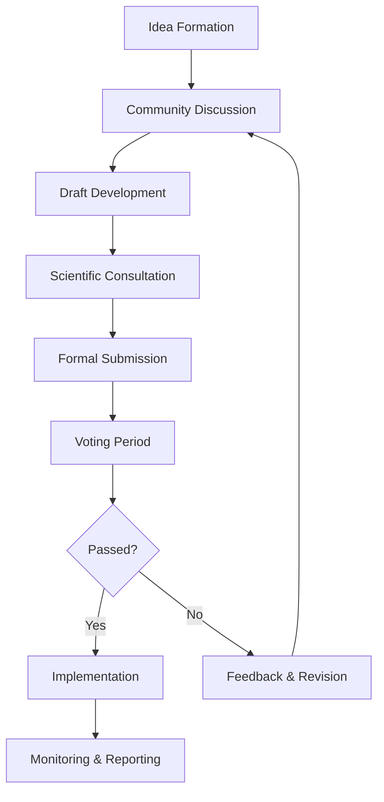

# THEIA Community Member Handbook

## Your Guide to Meaningful Participation

---

## Welcome Letter

Dear Community Member,

Welcome to TheiaDAO! By joining our community, you've become part of a movement dedicated to restoring vital waterways and ecosystems through the alignment of technology, community wisdom, and ecological science.

Whether you're drawn to our mission by a love of nature, interest in governance innovation, passion for community action, or curiosity about regenerative economics, you have an important role to play here. This handbook is designed to help you find your place within our community and make meaningful contributions to our shared mission.

Our strength lies in our diversity—of perspectives, skills, backgrounds, and ideas—united by a common vision of thriving ecosystems and communities. Every voice matters here, and we're excited to hear yours.

As you explore this handbook and our community, remember that we're building something new together. Your questions, insights, and participation will help shape not just the ecosystems we restore, but the very nature of our community itself.

Welcome to the journey of restoration and regeneration.

With appreciation,

*The TheiaDAO Core Contributors*

---

## Table of Contents

1. [Welcome Letter](#welcome-letter)
2. [Our Mission & Vision](#our-mission--vision)
3. [Community Values](#community-values)
4. [Getting Started](#getting-started)
5. [Finding Your Path](#finding-your-path)
6. [Ways to Contribute](#ways-to-contribute)
7. [Community Spaces](#community-spaces)
8. [Governance Participation](#governance-participation)
9. [Ecological Knowledge Basics](#ecological-knowledge-basics)
10. [Recognizing Contributions](#recognizing-contributions)
11. [Learning Resources](#learning-resources)
12. [Community Guidelines](#community-guidelines)
13. [Key Contacts](#key-contacts)
14. [Glossary of Terms](#glossary-of-terms)

---

## Our Mission & Vision

### Mission

**To restore vital waterways and empower the regrowth of keystone species through community-governed ecological initiatives funded by creative economic systems.**

### Vision

We envision a world where:

- **Thriving Ecosystems** support abundant biodiversity and clean water
- **Empowered Communities** direct and participate in ecological restoration
- **Aligned Economics** generate value while healing natural systems
- **Decentralized Governance** enables democratic stewardship of shared resources
- **Scientific Rigor** guides effective, evidence-based restoration approaches

### The Challenge We Address

Worldwide, waterways and their associated ecosystems face unprecedented threats:

- 35% of wetlands have disappeared since 1970
- 81% of freshwater species populations have declined significantly
- Monoculture farming has degraded soil and water systems globally
- Climate change is intensifying impacts on already vulnerable systems

### Our Approach

TheiaDAO takes a unique approach to ecological restoration by:

1. **Generating Revenue** through Vivid Visions creative agency
2. **Directing Resources** via community governance through THEIA tokens
3. **Implementing Restoration** through Canopy Culture's ecological initiatives
4. **Measuring Impact** with rigorous scientific methodology
5. **Building Community** around watershed stewardship and regeneration

This integrated model ensures that ecological restoration is financially sustainable, scientifically sound, and community-directed—creating a regenerative cycle that can scale and replicate.

## Community Values

Our community is guided by these core values:

### Ecological Integrity

We recognize that healthy ecosystems are the foundation of all life and commit to restoration practices that enhance biodiversity, improve watershed health, and strengthen ecosystem resilience.

> *"In every deliberation, we must consider the impact on the seventh generation."* — Iroquois teaching

### Scientific Rigor

We ground our decisions in the best available science while remaining open to diverse knowledge systems, including traditional ecological knowledge. We commit to evidence-based action and continuous learning.

> *"The good thing about science is that it's true whether or not you believe in it."* — Neil deGrasse Tyson

### Community Empowerment

We believe that lasting ecological change requires engaged communities. We commit to inclusive participation, shared decision-making, and equitable distribution of both responsibilities and benefits.

> *"Never doubt that a small group of thoughtful, committed citizens can change the world; indeed, it's the only thing that ever has."* — Margaret Mead

### Intergenerational Equity

We act as stewards for future generations, making decisions that consider long-term ecological health and the wellbeing of those who will inherit the ecosystems we restore.

> *"We do not inherit the Earth from our ancestors; we borrow it from our children."* — Native American proverb

### Transparency

We commit to open communication, clear documentation of decisions and outcomes, and accessible information about all aspects of our governance and ecological work.

> *"Sunlight is the best disinfectant."* — Louis Brandeis

### Regenerative Economics

We build economic systems that align incentives with ecological health, ensuring that our governance model creates value for both community members and the ecosystems we serve.

> *"The economy is a wholly owned subsidiary of the environment, not the other way around."* — Carl Safina

## Getting Started

Welcome aboard! Here's a simple pathway to begin your journey with TheiaDAO:

### First Steps (Week 1)

1. **Create Your Profile**
   - Set up your account on [community.theiadao.io](https://community.theiadao.io)
   - Add a profile picture and brief bio
   - Indicate your interests and skills

2. **Join Community Spaces**
   - Discord: [discord.gg/theiadao](https://discord.gg/theiadao)
   - Forum: [forum.theiadao.io](https://forum.theiadao.io)
   - Local chapter (if available in your area)

3. **Attend a Welcome Call**
   - Join our weekly orientation session (Thursdays at 12pm ET)
   - Meet other new members and community hosts
   - Ask initial questions and learn about current initiatives

4. **Set Up Your Wallet**
   - Follow the Technical Onboarding Guide to set up your Web3 wallet
   - Connect your wallet to the governance portal
   - Familiarize yourself with the basics of THEIA tokens

### Next Steps (Weeks 2-4)

1. **Explore Learning Resources**
   - Complete the Ecological Foundations course
   - Watch recorded governance tutorials
   - Browse the knowledge base for topics that interest you

2. **Attend Community Events**
   - Join a Community Call (Tuesdays at 3pm ET)
   - Participate in a working group meeting based on your interests
   - Attend virtual or local ecological education events

3. **Make Your First Contributions**
   - Introduce yourself in the community forum
   - Comment on active governance proposals
   - Join a discussion about ecological priorities

4. **Connect with Mentors**
   - Reach out to a community mentor in your area of interest
   - Schedule a 1:1 conversation to discuss your pathway
   - Ask questions about deeper involvement

### Ongoing Engagement

1. **Find Your Focus**
   - Identify which aspects of TheiaDAO most align with your interests
   - Join relevant working groups or project teams
   - Develop relationships with others sharing your focus

2. **Build Your Knowledge**
   - Take advanced courses in your areas of interest
   - Participate in skill-building workshops
   - Share resources with others on similar learning paths

3. **Participate in Governance**
   - Vote on active proposals that interest you
   - Join discussion threads about future initiatives
   - Consider creating or co-sponsoring proposals

4. **Connect to Ecological Work**
   - Join restoration activities in your watershed (if available)
   - Participate in monitoring programs
   - Attend site visits to restoration projects

## Finding Your Path

TheiaDAO offers multiple pathways for meaningful participation based on your interests, skills, and availability:

### Pathways Based on Interest

#### Ecological Restoration Enthusiasts
Focus on the hands-on work of restoring ecosystems, monitoring progress, and understanding ecological principles.

*Ideal if you: Love nature, enjoy outdoor activities, have background or interest in ecology, want tangible impact*

**Starting points:**
- Join the Restoration Practices working group
- Attend a monitoring training session
- Participate in a site visit to an active project

#### Governance Participants
Shape the direction of TheiaDAO through proposal creation, voting, discussion, and policy development.

*Ideal if you: Enjoy decision-making, have interest in organizational design, value democratic processes*

**Starting points:**
- Complete the Governance Fundamentals course
- Join governance discussion threads
- Attend proposal development workshops

#### Community Builders
Focus on strengthening community connections, facilitating participation, and supporting new members.

*Ideal if you: Enjoy connecting people, have strong communication skills, value relationship building*

**Starting points:**
- Join the Community Circle
- Volunteer as a new member buddy
- Help organize community events

#### Technical Contributors
Work on the technological systems that enable governance, monitoring, and community coordination.

*Ideal if you: Have technical skills, enjoy building tools, understand web3 technologies*

**Starting points:**
- Join the Tech Guild
- Contribute to open-source development
- Participate in tool testing and feedback

#### Knowledge Sharers
Focus on education, documentation, and translating complex topics for the broader community.

*Ideal if you: Enjoy teaching, have strong communication skills, can explain complex topics clearly*

**Starting points:**
- Join the Education Circle
- Contribute to the knowledge base
- Facilitate learning sessions

### Pathways Based on Time Commitment

#### Casual Participants (1-3 hours/week)
- Vote on governance proposals
- Participate in community discussions
- Attend monthly events
- Learn through self-paced resources

#### Active Contributors (4-8 hours/week)
- Join working groups
- Participate in regular community calls
- Contribute to specific projects
- Help develop proposals

#### Core Contributors (8+ hours/week)
- Lead working groups
- Guide significant initiatives
- Develop and steward proposals
- Mentor new community members

### Pathway Selection Process

1. **Self-Assessment**: Reflect on your interests, skills, and availability
2. **Exploration**: Try different activities to see what resonates
3. **Conversation**: Discuss options with community mentors
4. **Commitment**: Choose initial focus areas while remaining open to evolution
5. **Progression**: Develop deeper engagement over time as you build relationships

Remember that your pathway will likely evolve as you grow within the community. Many members engage across multiple areas or shift their focus over time based on community needs and personal growth.

## Ways to Contribute

There are countless ways to contribute to TheiaDAO, regardless of your background, skills, or time availability. Here are some of the most valuable contributions you can make:

### Governance Contributions

| Contribution | Description | Time Commitment | Impact |
|--------------|-------------|-----------------|--------|
| Voting | Cast informed votes on governance proposals | 30 min per proposal | Direct influence on decisions |
| Proposal Discussion | Comment on and ask questions about proposals | 1-2 hours per proposal | Improved decision quality |
| Proposal Creation | Develop and submit formal governance proposals | 5-20 hours per proposal | Initiate new directions |
| Policy Development | Help craft governance policies and frameworks | Ongoing, 2-4 hours/week | Systemic improvement |
| Delegation | Thoughtfully delegate your voting power | 1-2 hours initially, then monitoring | Effective representation |

### Ecological Contributions

| Contribution | Description | Time Commitment | Impact |
|--------------|-------------|-----------------|--------|
| Field Monitoring | Collect ecological data from restoration sites | 2-4 hours per session | Critical data collection |
| Restoration Activities | Participate in hands-on restoration work | 3-8 hours per event | Direct ecosystem improvement |
| Species Identification | Help identify flora and fauna in project areas | Flexible | Biodiversity assessment |
| Seed Collection | Gather native seeds for propagation | Seasonal, 2-4 hours | Restoration material sourcing |
| Site Assessment | Help evaluate potential restoration locations | 3-6 hours per site | Project planning support |

### Community Contributions

| Contribution | Description | Time Commitment | Impact |
|--------------|-------------|-----------------|--------|
| Member Welcome | Help onboard and orient new members | 1-2 hours per week | Community growth |
| Event Organization | Help plan and run community events | 3-10 hours per event | Community connection |
| Content Creation | Develop blogs, articles, or media about our work | Flexible | External awareness |
| Translation | Translate materials into other languages | Flexible | Accessibility |
| Community Moderation | Help maintain healthy community spaces | 2-4 hours per week | Community health |

### Knowledge Contributions

| Contribution | Description | Time Commitment | Impact |
|--------------|-------------|-----------------|--------|
| Educational Content | Create learning materials for the community | Flexible | Community capability |
| Documentation | Help document processes and decisions | 2-4 hours per document | Organizational memory |
| Research | Investigate specific questions to inform decisions | Varies by project | Evidence-based action |
| Mentorship | Guide newer members in your areas of expertise | 1-3 hours per week | Knowledge transfer |
| Workshop Facilitation | Lead learning sessions on relevant topics | 2-6 hours per workshop | Skill development |

### Technical Contributions

| Contribution | Description | Time Commitment | Impact |
|--------------|-------------|-----------------|--------|
| Tool Testing | Provide feedback on new tools and features | 1-3 hours per test | Improved functionality |
| Development | Contribute code to our open-source projects | Flexible | Enhanced capabilities |
| UX Feedback | Help improve user experiences | 1-2 hours per session | Improved accessibility |
| Technical Support | Help others with technical challenges | 2-4 hours per week | Community enablement |
| Data Analysis | Help process and interpret ecological data | Flexible | Insight generation |

### Getting Started with Contributions

1. **Begin Where You Are**: Start with contributions that match your current skills and available time
2. **Express Interest**: Join relevant channels and express your willingness to help
3. **Find Mentorship**: Connect with experienced contributors who can guide you
4. **Start Small**: Take on manageable tasks before committing to larger responsibilities
5. **Reflect & Grow**: Regularly consider how your contributions align with your interests and community needs

Remember that consistent, reliable contributions—even small ones—are often more valuable than occasional large efforts. Find a sustainable pace that works for your life and circumstances.

## Community Spaces

TheiaDAO maintains multiple spaces for community connection, collaboration, and communication:

### Digital Spaces

#### Discord

Our Discord server is the hub for real-time community interaction:

- **#welcome**: First stop for new members
- **#general**: Community-wide discussions
- **#governance**: Proposal discussions and voting coordination
- **#ecological-chat**: Conversations about restoration science and practice
- **#tech-support**: Help with technical questions
- **Working Group channels**: Focused conversation for specific initiatives
- **Regional channels**: Local coordination and planning

*Join at: [discord.gg/theiadao](https://discord.gg/theiadao)*

#### Forum

Our forum hosts in-depth, persistent discussions on important topics:

- **Governance Proposals**: Formal discussion of active proposals
- **Ecological Knowledge**: Sharing of research and insights
- **Community Development**: Discussion of community needs and improvements
- **Working Group Updates**: Progress reports from various initiatives
- **General Discussion**: Broad topics of community interest

*Access at: [forum.theiadao.io](https://forum.theiadao.io)*

#### Governance Portal

The central hub for formal governance participation:

- **Proposal System**: Create, view, and vote on proposals
- **Token Management**: Lock tokens and manage voting power
- **Project Tracking**: Monitor ecological restoration progress
- **Resource Library**: Access guides and documentation
- **Member Directory**: Connect with other community members

*Access at: [governance.theiadao.io](https://governance.theiadao.io)*

#### Community Calendar

Comprehensive listing of all community events:

- **Community Calls**: Regular all-community gatherings
- **Working Group Meetings**: Focused sessions for specific teams
- **Learning Events**: Educational workshops and presentations
- **Governance Events**: Proposal discussions and voting periods
- **Field Activities**: Restoration work and monitoring events

*Access at: [calendar.theiadao.io](https://calendar.theiadao.io)*

### Regular Virtual Events

| Event | Frequency | Description | Open To |
|-------|-----------|-------------|---------|
| Community Call | Weekly (Tuesdays, 3pm ET) | General updates and community-wide topics | Everyone |
| Welcome Session | Weekly (Thursdays, 12pm ET) | Orientation for new members | New members |
| Governance Roundtable | Bi-weekly (Wednesdays, 2pm ET) | Discussion of active proposals | Everyone |
| Ecological Knowledge Share | Monthly (First Monday, 1pm ET) | Presentations on restoration science | Everyone |
| Working Group Syncs | Varies by group | Coordination within working groups | Group members |
| Open Office Hours | Weekly (Fridays, 12-2pm ET) | Drop-in time with core contributors | Everyone |

### Local Chapters

TheiaDAO supports in-person community building through local chapters:

#### Active Chapters

- **Pacific Northwest**: Focused on Willow Creek watershed
- **Appalachian Region**: Centered on Blue River Basin
- **Great Lakes**: Supporting Eastern Wetland Complex
- **Gulf Coast**: Working with Coastal Estuary System
- **Sierra Madre**: Collaboration with local communities

#### Chapter Activities

- **Field Days**: Hands-on restoration work
- **Monitoring Events**: Community science activities
- **Knowledge Exchanges**: Learning from local experts
- **Social Gatherings**: Community building and connection
- **Governance Watch Parties**: Group participation in governance

#### Starting a Chapter

If no chapter exists in your area:
1. Connect with at least 5 interested local members
2. Complete the Chapter Starter application
3. Participate in chapter leader training
4. Receive starter resources and guidance
5. Host your first local event

### Communication Norms

To foster healthy, productive communication across all spaces:

1. **Assume Good Intent**: Approach conversations with the assumption that others are acting in good faith
2. **Ask Questions**: Seek clarification before disagreeing or making assumptions
3. **Stay Topic-Focused**: Keep conversations relevant to the channel or thread topic
4. **Be Concise**: Respect others' attention by being clear and brief
5. **Use Appropriate Channels**: Post content in the most relevant space
6. **Provide Context**: Give sufficient background when starting new discussions
7. **Respect Differences**: Acknowledge that community members have diverse perspectives
8. **Acknowledge Sources**: Credit others' ideas and contributions
9. **Bridge Knowledge Gaps**: Help explain complex topics to newer members
10. **Balance Speaking and Listening**: Make space for diverse voices

## Governance Participation

Participating in governance is one of the most important ways you can contribute to TheiaDAO. Here's how to get involved effectively:

### Governance Philosophy

Our governance approach is founded on these principles:

- **Quadratic Voting**: Voting power scales with the square root of tokens, balancing influence
- **Scientific Oversight**: Ecological expertise guides decision-making
- **Deliberative Process**: Decisions improve through thoughtful discussion
- **Transparency**: All governance processes are open and documented
- **Inclusion**: Multiple pathways for participation regardless of token holdings

### Levels of Participation

You can engage with governance at different levels based on your interest and capacity:

#### Observer
- Follow active proposals
- Read discussion threads
- Attend governance calls
- Learn governance processes

#### Voter
- Cast informed votes on proposals
- Participate in discussion threads
- Provide feedback on proposals
- Delegate voting power thoughtfully

#### Contributor
- Help develop proposals with others
- Provide specialized input on topics
- Join working groups on governance
- Support proposal implementation

#### Leader
- Initiate and steward proposals
- Facilitate governance discussions
- Mentor others in governance
- Help evolve governance systems

### The Proposal Journey

### Effective Governance Participation

#### For Voters

1. **Do Your Research**
   - Read the full proposal, not just the summary
   - Review discussion threads and comments
   - Consider ecological impact and alignment with values
   - Ask questions if anything is unclear

2. **Vote Thoughtfully**
   - Consider the proposal's merits objectively
   - Weigh both short and long-term implications
   - Vote according to ecosystem benefit, not personal gain
   - Provide rationale for your vote when possible

3. **Engage in Discussion**
   - Ask clarifying questions
   - Offer constructive feedback
   - Share relevant experience or knowledge
   - Be respectful of differing viewpoints

#### For Proposal Creators

1. **Start with Community Input**
   - Test ideas informally before formal submission
   - Gather diverse perspectives early
   - Address concerns proactively
   - Build coalition support

2. **Craft Clear Proposals**
   - State objectives precisely
   - Explain the ecological rationale
   - Detail implementation plans
   - Specify success metrics

3. **Respond to Feedback**
   - Engage actively with questions
   - Incorporate valuable suggestions
   - Address concerns transparently
   - Be open to refinement

### Delegation

If you cannot actively participate in all governance decisions, delegation allows you to assign your voting power to trusted representatives:

1. **Choosing a Delegate**
   - Review voting history and rationale
   - Assess alignment with your values
   - Consider their areas of expertise
   - Evaluate their communication style

2. **Delegation Options**
   - Full delegation: All your voting power
   - Partial delegation: A portion of your voting power
   - Topic-specific: Delegation for certain categories
   - Time-limited: Delegation for specific periods

3. **Responsible Delegation**
   - Monitor your delegate's voting
   - Maintain communication about priorities
   - Reconsider delegation periodically
   - Provide feedback on decisions

### Governance Resources

- **Governance Guide**: Comprehensive explanation of processes
- **Proposal Template**: Standard format for proposal creation
- **Decision Records**: Archive of past proposals and outcomes
- **Governance Calendar**: Upcoming votes and discussion periods
- **Delegation Directory**: Profiles of active delegates

## Ecological Knowledge Basics

Understanding foundational ecological concepts helps you participate more effectively in TheiaDAO. Here's an introduction to key concepts relevant to our restoration work:

### Watershed Fundamentals

A watershed is an area of land where all precipitation drains to a common body of water. Our restoration work focuses on watersheds because:

- They connect terrestrial and aquatic ecosystems
- They cross political boundaries, requiring collaborative governance
- They directly impact water quality for wildlife and human communities
- They provide a natural framework for measuring ecological health

**Key Components of a Healthy Watershed:**
- Intact riparian zones (streamside vegetation)
- Natural flow regimes (water quantity and timing)
- Diverse aquatic and terrestrial habitats
- Functioning nutrient cycles
- Connected movement corridors for wildlife

### Ecological Principles

These core principles guide effective ecosystem restoration:

#### 1. Connectivity
Ecosystems function through connections between species, habitats, and processes. Restoring these connections is often more important than focusing on isolated elements.

*Example: Removing a dam may reconnect fish populations, restore sediment flow, and influence plant communities along the entire stream.*

#### 2. Keystone Species
Some species have disproportionate effects on ecosystems relative to their abundance. Focusing on these species often creates cascading benefits.

*Example: Beaver reintroduction can transform stream hydrology, creating wetlands that benefit hundreds of other species.*

#### 3. Disturbance Regimes
Natural disturbances like floods, fires, and storms are essential parts of ecosystem function, not disruptions to be prevented.

*Example: Periodic flooding is necessary for floodplain forest regeneration and nutrient distribution.*

#### 4. Ecological Memory
Ecosystems retain "memory" of past conditions in soil properties, seed banks, and biological legacies that influence restoration outcomes.

*Example: Even after decades of agriculture, native plant seeds may remain viable in the soil, aiding recovery when conditions change.*

#### 5. Novel Ecosystems
Human impacts have created combinations of species and conditions with no historical precedent. Restoration must sometimes work with these new realities.

*Example: Climate change may make historic plant communities impossible to restore, requiring adaptation-focused approaches.*

### Restoration Approaches

TheiaDAO employs several restoration strategies depending on site conditions and goals:

#### Passive Restoration
Removing stressors and allowing natural recovery processes to operate.

*When to use: Systems with high recovery potential, minimal ongoing stressors, and intact seed sources.*

#### Active Restoration
Direct intervention to accelerate or guide recovery processes.

*When to use: Heavily degraded systems, missing key species or processes, specific desired outcomes.*

#### Process-Based Restoration
Focusing on restoring natural processes rather than specific end states.

*When to use: Complex systems where specific outcomes are difficult to predict, multiple benefits desired.*

#### Reference-Based Restoration
Using intact ecosystems as models for restoration goals and methods.

*When to use: Similar intact systems exist nearby, historical conditions are achievable.*

### Measuring Success

TheiaDAO uses multiple metrics to assess restoration outcomes:

#### Structural Metrics
Physical characteristics of the ecosystem:
- Plant community composition
- Habitat diversity
- Channel morphology
- Soil properties

#### Functional Metrics
Processes and interactions within the ecosystem:
- Nutrient cycling
- Energy flow
- Hydrological patterns
- Species interactions

#### Services Metrics
Benefits provided to human communities:
- Water quality
- Flood mitigation
- Carbon sequestration
- Recreational opportunities

#### Resilience Metrics
Ability to recover from disturbance:
- Response to drought or flood
- Invasive species resistance
- Adaptation to climate variability
- Self-sustainability

### Common Restoration Challenges

Understanding typical challenges helps set realistic expectations:

1. **Time Lags**: Many ecological processes take decades to develop
2. **Novel Constraints**: Urban development, climate change create new limitations
3. **Invasive Species**: Non-native species can disrupt restoration trajectories
4. **Social Conflicts**: Different stakeholders may have competing priorities
5. **Funding Continuity**: Long-term monitoring and maintenance require sustained resources

### Ecological Learning Resources

To deepen your understanding:

- **Ecological Basics Course**: Available in the learning portal
- **Field Guides**: Watershed-specific identification resources
- **Restoration Case Studies**: Documented examples from our projects
- **Scientific Advisory Board**: Regular educational presentations
- **Guided Field Visits**: Opportunities to see principles in practice

## Recognizing Contributions

TheiaDAO celebrates and recognizes community contributions through multiple mechanisms:

### Contribution Tracking

The following contributions are tracked in our community system:

- **Governance Participation**: Votes cast, proposals created, discussions joined
- **Ecological Activities**: Monitoring sessions, restoration events, data submissions
- **Community Support**: Onboarding assistance, event organization, moderation
- **Knowledge Sharing**: Educational content, documentation, mentorship
- **Technical Development**: Code contributions, testing, support provided

### Recognition Systems

#### Community Badges
Digital credentials displayed on your profile that recognize specific achievements or contributions:

| Badge Category | Examples | How to Earn |
|----------------|----------|-------------|
| Governance | Voter, Proposal Creator, Delegate | Participate in governance activities |
| Ecological | Field Monitor, Restoration Contributor, Species Spotter | Participate in ecological activities |
| Community | Welcomer, Event Host, Bridge Builder | Support community development |
| Knowledge | Educator, Documentarian, Researcher | Share knowledge and insights |
| Technical | Builder, Bug Hunter, Support Provider | Contribute to technical systems |

#### Impact Recognition
Highlighting the tangible ecological outcomes that community members help create:

- **Watershed Report Cards**: Regular updates on restoration progress
- **Impact Narratives**: Stories connecting individual contributions to outcomes
- **Before/After Documentation**: Visual evidence of ecosystem change
- **Species Return Celebrations**: Recognition when key species reestablish

#### Community Spotlights
Regular features celebrating individual and group contributions:

- **Member of the Month**: Highlighting exemplary contributors
- **Team Accomplishments**: Celebrating working group milestones
- **Contribution Stories**: Narrative features about specific contributions
- **Community Interviews**: In-depth conversations with active members

### Token-Based Recognition

Contribution tokens (separate from governance tokens) recognize valuable participation:

- **Earned through** verified contributions to the ecosystem
- **Recorded on** community leaderboards and profiles
- **Convertible to** governance tokens through community proposals
- **Eligible for** special participation opportunities

### Community Rituals

Regular practices that build culture around recognition:

- **Gratitude Circles**: Time in community calls to acknowledge contributions
- **Seasonal Celebrations**: Quarterly events marking collective progress
- **Milestone Ceremonies**: Recognition of significant community achievements
- **Annual Impact Gathering**: Comprehensive celebration of yearly progress

### Requesting Recognition

If you notice unrecognized contributions:

1. **Self-Advocacy**: Submit contribution records through your profile
2. **Peer Recognition**: Nominate others for appropriate recognition
3. **Working Group Acknowledgment**: Ensure team contributions are documented
4. **Feedback on Systems**: Suggest improvements to recognition mechanisms

## Learning Resources

TheiaDAO provides numerous resources to support your learning journey:

### Learning Pathways

Structured sequences of learning resources for different interests:

#### Ecological Restoration Pathway
1. Watershed Basics (Introduction)
2. Restoration Principles (Fundamentals)
3. Monitoring Methods (Practical)
4. Ecosystem Specific Modules (Specialized)
5. Restoration Design (Advanced)

#### Governance Participation Pathway
1. Governance Fundamentals (Introduction)
2. Proposal Analysis (Practical)
3. Effective Discussion (Communication)
4. Proposal Creation (Advanced)
5. Governance Design (Specialized)

#### Community Building Pathway
1. Community Values (Introduction)
2. Effective Communication (Fundamentals)
3. Facilitation Skills (Practical)
4. Conflict Resolution (Specialized)
5. Community System Design (Advanced)

#### Technical Contribution Pathway
1. Web3 Basics (Introduction)
2. TheiaDAO Technical Overview (Fundamentals)
3. Contribution Guidelines (Practical)
4. Development Environment (Specialized)
5. System Architecture (Advanced)

### Learning Formats

Multiple formats to accommodate different learning preferences:

| Format | Examples | Best For |
|--------|----------|----------|
| Written Guides | Manuals, articles, documentation | Self-paced, reference |
| Video Tutorials | Recorded walkthroughs, presentations | Visual learners |
| Interactive Workshops | Hands-on sessions with facilitators | Experiential learning |
| Peer Learning Circles | Small group discussion and practice | Collaborative learning |
| Field Learning | On-site demonstration and practice | Practical application |

### Key Learning Resources

#### Ecological Knowledge
- **Watershed Restoration Handbook**: Comprehensive guide to principles and practices
- **Species Identification Guides**: Regional flora and fauna references
- **Monitoring Protocols**: Step-by-step guides for data collection
- **Case Studies Library**: Documented examples from past projects
- **Scientific Paper Summaries**: Accessible versions of relevant research

#### Governance Participation
- **Governance Framework Guide**: Complete explanation of decision processes
- **Proposal Analysis Toolkit**: Methods for evaluating proposals
- **Deliberative Discussion Guide**: Facilitating productive conversations
- **Proposal Creation Workshop**: Templates and best practices
- **Delegation Handbook**: Responsible delegation approaches

#### Community Engagement
- **Community Values Workbook**: Exploring and applying shared values
- **Communication Practices Guide**: Effective community interaction
- **Event Facilitation Toolkit**: Running productive gatherings
- **Conflict Resolution Framework**: Addressing disagreements constructively
- **Inclusive Participation Guide**: Ensuring diverse engagement

#### Technical Resources
- **Technical Architecture Documentation**: System design and interactions
- **Contribution Guidelines**: Standards for technical contributions
- **Development Setup Guide**: Local environment configuration
- **API Documentation**: Interfaces for building integrations
- **Security Best Practices**: Protecting community systems

### Learning Events

Regular opportunities for interactive learning:

| Event | Frequency | Format | Focus |
|-------|-----------|--------|-------|
| Ecological Workshops | Monthly | Interactive | Hands-on skills |
| Governance Clinics | Bi-weekly | Discussion | Process understanding |
| Tech Talks | Monthly | Presentation | Technical deep dives |
| Field Trainings | Seasonal | On-site | Practical application |
| Knowledge Exchanges | Quarterly | Conference | Diverse topics |

### Learning Support

Resources to help you in your learning journey:

- **Learning Mentors**: Experienced members who can guide your development
- **Study Groups**: Peer learning for specific topics
- **Office Hours**: Regular sessions with subject matter experts
- **Learning Feedback**: Opportunities to shape educational resources
- **Custom Learning Plans**: Personalized guidance for your interests

## Community Guidelines

To foster a healthy, productive community, we follow these guidelines:

### Communication Principles

1. **Respect Diverse Perspectives**
   - Acknowledge that members come from different backgrounds and viewpoints
   - Listen actively to understand before responding
   - Value different forms of knowledge and experience
   - Avoid dismissive language or tone

2. **Focus on Ideas, Not Individuals**
   - Critique concepts rather than people
   - Separate disagreement from personal criticism
   - Ask questions to clarify thinking
   - Acknowledge good ideas regardless of source

3. **Practice Constructive Communication**
   - Frame feedback to help improve ideas
   - Offer alternatives when identifying problems
   - Balance critique with appreciation
   - Communicate with clarity and concision

4. **Bridge Knowledge Gaps**
   - Explain technical terms when using them
   - Avoid unnecessary jargon and acronyms
   - Share context for specialized knowledge
   - Welcome and answer questions patiently

5. **Assume Good Intent**
   - Begin with the assumption that others are acting in good faith
   - Seek clarification rather than making assumptions
   - Give others the benefit of the doubt
   - Address misunderstandings directly and kindly

### Community Behavioral Standards

1. **Inclusivity**
   - Welcome all participants regardless of background
   - Make space for diverse voices and perspectives
   - Consider accessibility in all activities
   - Actively invite participation from underrepresented groups

2. **Accountability**
   - Follow through on commitments
   - Acknowledge and take responsibility for mistakes
   - Accept and provide feedback graciously
   - Uphold community values consistently

3. **Transparency**
   - Share decision-making processes openly
   - Disclose relevant interests and relationships
   - Provide context for actions and positions
   - Communicate changes and developments clearly

4. **Collaborative Spirit**
   - Seek opportunities for cooperation rather than competition
   - Build on others' ideas constructively
   - Share credit generously
   - Support others' success and growth

5. **Ecological Focus**
   - Center ecosystem health in discussions and decisions
   - Connect community activities to ecological outcomes
   - Remain true to the restoration mission
   - Balance human and ecosystem needs

### Conflict Resolution Process

When disagreements or tensions arise:

1. **Direct Communication**
   - Address concerns directly with the involved parties
   - Focus on specific behaviors or issues, not personalities
   - Use "I" statements to express your perspective
   - Listen actively to understand other viewpoints

2. **Mediated Conversation**
   - If direct communication doesn't resolve the issue, request a neutral mediator
   - Community stewards are available to facilitate difficult conversations
   - Focus on finding mutually acceptable solutions
   - Document agreements for future reference

3. **Working Group Review**
   - For issues affecting group work, the relevant working group can review
   - Present all perspectives fairly
   - Focus on impact to community goals and values
   - Develop actionable recommendations

4. **Community Council**
   - For significant unresolved conflicts, the Community Council can provide guidance
   - Council includes diverse representation from across the community
   - Decisions focus on community health and mission alignment
   - Recommendations are non-binding but carry significant weight

### Moderation Approach

When guidelines aren't followed, moderation follows these principles:

1. **Educational First**
   - Begin with the assumption that people may not know the guidelines
   - Provide clear information about expectations
   - Offer guidance for better alignment
   - Focus on growth rather than punishment

2. **Graduated Response**
   - Start with gentle reminders for minor or first issues
   - Escalate carefully based on pattern or severity
   - Apply temporary limitations when necessary
   - Reserve removal only for serious or persistent violations

3. **Transparent Process**
   - Document moderation decisions and rationale
   - Communicate clearly with affected individuals
   - Make moderation policies accessible to all
   - Review moderation practices regularly for fairness

4. **Appeal Pathway**
   - All moderation decisions can be appealed
   - Appeals reviewed by different moderators than original decision
   - Focus on fair application of guidelines
   - Balance community needs with individual circumstances

### Creating a Welcoming Environment

We all share responsibility for creating a welcoming community:

1. **Active Welcome**
   - Greet new members in community spaces
   - Offer orientation and assistance
   - Introduce newcomers to relevant people and resources
   - Follow up to ensure people find their place

2. **Knowledge Sharing**
   - Offer help with navigating community systems
   - Share context and background for ongoing discussions
   - Explain insider terminology and concepts
   - Create bridges between different knowledge areas

3. **Participation Support**
   - Invite specific contributions from others
   - Create entry points for different skill levels
   - Acknowledge and appreciate all forms of contribution
   - Remove barriers to meaningful participation

4. **Personal Connection**
   - Take interest in others as whole people
   - Make space for authentic sharing
   - Connect around shared interests beyond the work
   - Celebrate personal and collective milestones

## Key Contacts

### Community Support

**Community Stewards Team**  
*For general questions, community concerns, and guidance*  
community@theiadao.io  
Discord: @CommunityTeam  

**New Member Support**  
*For onboarding assistance and orientation*  
welcome@theiadao.io  
Discord: @WelcomeTeam  

**Conflict Resolution Circle**  
*For help with difficult conversations or community tensions*  
resolution@theiadao.io  
Discord: @ResolutionTeam  

### Governance Support

**Governance Facilitation Team**  
*For questions about proposals, voting, and decision processes*  
governance@theiadao.io  
Discord: @GovernanceTeam  

**Proposal Support Circle**  
*For assistance developing and refining proposals*  
proposals@theiadao.io  
Discord: @ProposalHelp  

**Scientific Advisory Board**  
*For ecological guidance and scientific consultation*  
science@theiadao.io  
Discord: @ScienceTeam  

### Technical Support

**Technical Assistance Team**  
*For help with wallets, tokens, and technical tools*  
tech@theiadao.io  
Discord: @TechSupport  

**Development Team**  
*For questions about code, contributions, and bugs*  
dev@theiadao.io  
Discord: @DevTeam  

**Security Response**  
*For reporting security concerns or vulnerabilities*  
security@theiadao.io  
Discord: @SecurityTeam  

### Ecological Program Contacts

**Restoration Coordination**  
*For questions about field projects and activities*  
restoration@theiadao.io  
Discord: @RestorationTeam  

**Monitoring Program**  
*For questions about ecological monitoring and data*  
monitoring@theiadao.io  
Discord: @MonitoringTeam  

**Watershed Teams**  
*For watershed-specific questions and local activities*  
willow@theiadao.io  
blueriver@theiadao.io  
eastern@theiadao.io  
coastal@theiadao.io  
sierramadre@theiadao.io  

### Working Group Contacts

*For specific initiatives and focus areas - find current contact information in the governance portal*

## Glossary of Terms

### Ecological Terms

**Biodiversity**: The variety of life in a particular habitat or ecosystem, including diversity within species, between species, and of ecosystems.

**Ecosystem**: A community of living organisms interacting with each other and their physical environment as a system.

**Keystone Species**: A species that has a disproportionately large effect on its environment relative to its abundance, playing a critical role in maintaining ecosystem structure.

**Restoration**: The process of assisting the recovery of an ecosystem that has been degraded, damaged, or destroyed.

**Riparian**: Relating to or situated on the banks of a river or stream.

**Watershed**: An area of land where all precipitation drains to a common body of water.

**Wetland**: Land that is saturated with water, either permanently or seasonally, creating a distinct ecosystem.

**Ecological Succession**: The process of change in the species structure of an ecological community over time.

**Invasive Species**: Non-native species that spread aggressively and cause harm to the environment, economy, or human health.

**Hydrology**: The study of the movement, distribution, and quality of water throughout Earth.

### Governance Terms

**Proposal**: A formal suggestion put forward for consideration and decision by the community.

**Quorum**: The minimum level of participation required for a governance decision to be valid.

**Quadratic Voting**: A collective decision-making procedure where voting power scales with the square root of the number of tokens, reducing the power of large token holders.

**Delegation**: The assignment of voting power from one community member to another.

**Treasury**: The collective assets controlled by TheiaDAO governance.

**Working Group**: A team focused on a specific area of work or expertise within the community.

**Consensus**: General agreement or accord among community members.

**Parameter**: A variable within the governance system that can be adjusted through proposals.

**Veto**: The power to reject a decision or proposal, held by the Scientific Advisory Board for ecological alignment.

**Ratification**: The formal confirmation or approval of a governance decision.

### Technical Terms

**Blockchain**: A distributed database that maintains a continuously growing list of records secured from tampering and revision.

**Smart Contract**: Self-executing contracts with the terms directly written into code.

**Wallet**: Software that allows users to interact with the blockchain, manage digital assets, and sign transactions.

**Token**: A digital asset that represents a specific utility or value within a system.

**Multi-sig**: A security feature requiring multiple signatures (approvals) to execute certain actions.

**Gas Fee**: The cost to perform a transaction on a blockchain network.

**Bridge**: Technology that enables the transfer of tokens between different blockchain networks.

**DAO**: Decentralized Autonomous Organization, an entity governed by smart contracts and community decisions rather than traditional hierarchical management.

**Quadratic Formula**: Mathematical approach that calculates voting power as the square root of tokens, making influence scale sub-linearly with token holdings.

**Locking**: Temporarily committing tokens to gain governance rights, showing long-term commitment.

### Community Terms

**Core Contributor**: Community members with significant ongoing responsibilities and contributions.

**Working Group**: A team focused on a specific area of work within the community.

**Circle**: A cross-functional group addressing a particular community need or function.

**Steward**: A community member with responsibility for maintaining community health in a specific area.

**Mentorship**: Relationship where experienced members guide newer participants.

**Onboarding**: The process of integrating new members into the community.

**Contributor**: Any community member who actively participates and adds value.

**Governance Portal**: The technical interface for participating in formal decision-making.

**Forum**: The online space for asynchronous, in-depth community discussions.

**Ecological Impact**: The measurable effect of our work on ecosystem health and function.

---

*This handbook is a living document that will evolve with our community. Last updated: March 2025.*

*Your feedback helps improve this resource for all community members. Please share suggestions at handbook@theiadao.io.*

---

**TheiaDAO: Regenerating ecosystems through aligned governance and community action**
