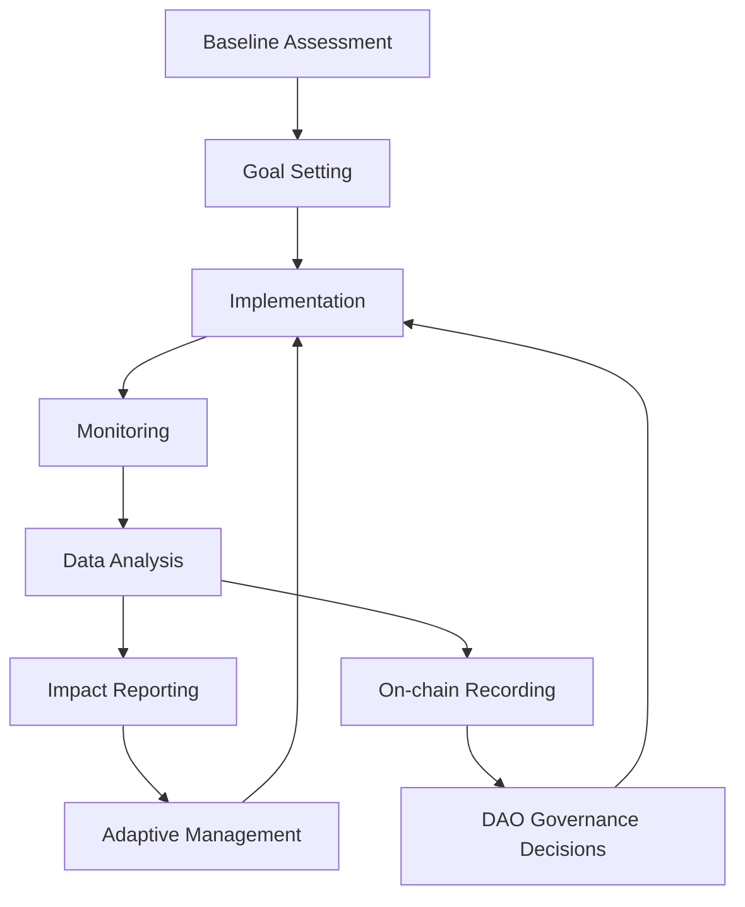
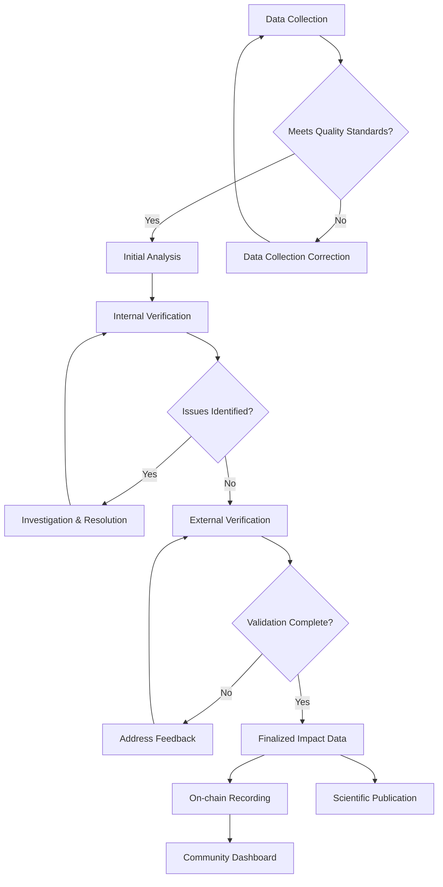
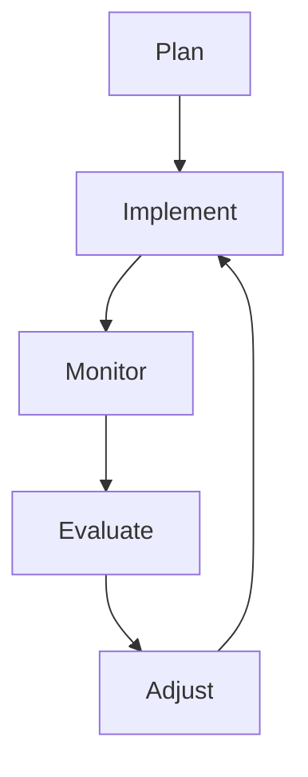

# THEIA Ecological Impact Framework

## Measuring Restoration Success, Ensuring Accountability


---

## Table of Contents

1. [Introduction](#introduction)
2. [Ecological Focus Areas](#ecological-focus-areas)
3. [Measurement Methodology](#measurement-methodology)
4. [Baseline Establishment](#baseline-establishment)
5. [Key Performance Indicators](#key-performance-indicators)
6. [Monitoring Timeline](#monitoring-timeline)
7. [Verification & Validation](#verification--validation)
8. [Data Management & Transparency](#data-management--transparency)
9. [Case Studies](#case-studies)
10. [Community Participation](#community-participation)
11. [Adaptive Management](#adaptive-management)
12. [Resources & Tools](#resources--tools)

---

## Introduction

The THEIA Ecological Impact Framework provides a structured approach to measuring, verifying, and communicating the outcomes of our restoration efforts. This document serves as both a technical guide for implementing partners and an accessible overview for community members interested in understanding how we track our ecological impact.

### Core Principles

1. **Scientific Rigor**: Measurements based on established ecological science
2. **Transparency**: Open access to methodologies, data, and results
3. **Practicality**: Balancing scientific precision with implementation feasibility
4. **Community Accessibility**: Making technical information understandable to all
5. **Adaptive Learning**: Continuous improvement of measurement approaches

### Framework Overview



## Ecological Focus Areas

THEIA's restoration efforts focus on interconnected ecological systems with an emphasis on watershed health. Our primary focus areas include:

### Watershed Restoration

Restoring the natural flow, quality, and ecological functioning of water systems from headwaters to confluences.

| Sub-Focus | Description | Ecosystem Services |
|-----------|-------------|-------------------|
| Stream Morphology | Channel shape, sinuosity, bed composition | Flood mitigation, habitat structure |
| Riparian Buffers | Vegetated zones along waterways | Filtration, shade, bank stability |
| Hydrological Connectivity | Natural water movement patterns | Species migration, nutrient cycling |
| Flow Regimes | Timing, volume, and duration of water flows | Drought resilience, reproduction cues |

### Biodiversity Enhancement

Increasing the variety and abundance of native species and the complexity of ecological relationships.

| Sub-Focus | Description | Ecosystem Services |
|-----------|-------------|-------------------|
| Native Vegetation | Plant communities appropriate to the locale | Habitat, food sources, soil stability |
| Keystone Species | Organisms with outsized ecological influence | Ecosystem engineering, trophic cascades |
| Habitat Diversity | Variety of ecological niches | Species richness, ecological resilience |
| Ecological Networks | Connections between species and habitats | Pollination, seed dispersal, predator-prey |

### Soil Health Restoration

Rebuilding the living foundation of terrestrial ecosystems and their carbon sequestration capacity.

| Sub-Focus | Description | Ecosystem Services |
|-----------|-------------|-------------------|
| Soil Structure | Physical arrangement of soil particles | Water infiltration, root growth |
| Soil Biology | Microorganisms, fungi, and soil fauna | Nutrient cycling, decomposition |
| Soil Chemistry | Nutrient availability and balance | Plant growth, water quality |
| Carbon Sequestration | Storage of carbon in soil organic matter | Climate regulation, soil fertility |

### Agricultural Transition

Supporting the conversion from industrial agricultural practices to regenerative approaches.

| Sub-Focus | Description | Ecosystem Services |
|-----------|-------------|-------------------|
| Regenerative Techniques | Practices that build rather than deplete | Reduced pollution, increased fertility |
| Polyculture Development | Diverse crop and integrated systems | Pest resistance, yield stability |
| Water-Smart Agriculture | Efficient and ecologically sound water use | Drought resilience, reduced runoff |
| Habitat Integration | Agricultural lands that support wildlife | Pest control, pollination, biodiversity |

## Measurement Methodology

THEIA employs a systematic approach to measuring ecological impact that balances scientific rigor with practical implementation:

### Methodological Principles

1. **Multiple Lines of Evidence**: Using several measurement approaches to cross-validate findings
2. **Reference Ecosystems**: Comparing restoration sites to intact ecosystems as aspirational targets
3. **Functional Indicators**: Focusing on ecosystem processes, not just structural elements
4. **Scale-Appropriate Metrics**: Matching measurements to the spatial and temporal scale of projects
5. **Standardized Protocols**: Using consistent methods across sites for comparability

### Measurement Approach

```
┌───────────────┐    ┌───────────────┐    ┌───────────────┐
│ QUANTITATIVE  │    │ QUALITATIVE   │    │ TECHNOLOGICAL │
│ - Field surveys│    │ - Expert      │    │ - Remote      │
│ - Lab analysis │    │   assessment  │    │   sensing     │
│ - Statistical  │    │ - Traditional │    │ - IoT sensors │
│   modeling     │    │   knowledge   │    │ - eDNA        │
└───────────────┘    └───────────────┘    └───────────────┘
        │                    │                     │
        v                    v                     v
   ┌──────────────────────────────────────────────────┐
   │            INTEGRATED ASSESSMENT                  │
   │  Combining multiple data types for holistic view  │
   └──────────────────────────────────────────────────┘
                          │
                          v
   ┌──────────────────────────────────────────────────┐
   │               IMPACT EVALUATION                   │
   │    Measuring change against project objectives    │
   └──────────────────────────────────────────────────┘
```

## Baseline Establishment

Every restoration project begins with a comprehensive baseline assessment to establish pre-intervention conditions and set realistic targets:

### Baseline Components

1. **Ecological Status Assessment**: Current condition of key ecological elements
2. **Historical Research**: Understanding the ecosystem's past state and changes
3. **Reference Site Analysis**: Study of similar, intact ecosystems as aspirational models
4. **Stressor Identification**: Documentation of current ecological degradation factors
5. **Stakeholder Knowledge Integration**: Local and traditional understanding of the ecosystem

### Standard Baseline Protocol

| Phase | Activities | Outputs | Timeline |
|-------|------------|---------|----------|
| Planning | Site selection, methodology planning | Sampling plan, site maps | 1-2 months |
| Field Assessment | Surveys, sampling, photodocumentation | Raw ecological data | 2-3 months |
| Laboratory Analysis | Sample processing, testing | Analytical results | 1-2 months |
| Data Integration | Statistical analysis, reference comparison | Baseline condition report | 1 month |
| Target Setting | Defining realistic ecological goals | Restoration targets document | 1 month |

### Example Baseline Documentation

Each restoration site receives comprehensive baseline documentation that includes:

- **Site Atlas**: Maps, imagery, and geospatial data showing current conditions
- **Species Inventory**: Catalog of observed flora and fauna with abundance estimates
- **Soil Analysis**: Physical, chemical, and biological soil characteristics
- **Hydrological Assessment**: Water flow patterns, quality, and seasonal variations
- **Disturbance History**: Documentation of human impacts and natural disturbances
- **Ecological Trajectory Modeling**: Projection of site development with and without intervention

## Key Performance Indicators

THEIA tracks a standardized set of Key Performance Indicators (KPIs) across all restoration projects, supplemented by site-specific metrics:

### Core KPIs

| Indicator Category | Metrics | Measurement Method | Ecological Significance |
|-------------------|---------|---------------------|-------------------------|
| **Water Quality** |
| Chemical Parameters | pH, dissolved oxygen, conductivity, nutrient levels | Field sensors, lab analysis | Habitat suitability for aquatic life |
| Biological Indicators | Macroinvertebrate diversity index, algal blooms | Field sampling, microscopy | Ecosystem health, trophic function |
| Physical Parameters | Temperature, turbidity, sedimentation rate | Continuous monitoring, sediment traps | Habitat quality, light penetration |
| Contaminants | Heavy metals, pesticides, pharmaceuticals | Lab analysis, passive samplers | Ecosystem and human health safety |
| **Biodiversity** |
| Species Richness | Number of native species by taxonomic group | Field surveys, eDNA sampling | Ecological complexity |
| Species Abundance | Population estimates for key species | Transect surveys, camera traps | Ecosystem function, trophic structure |
| Community Composition | Similarity to reference ecosystem | Multivariate statistical analysis | Restoration trajectory |
| Habitat Structure | Vegetation layers, physical features | Structural complexity measurements | Niche availability |
| **Hydrology** |
| Flow Regime | Volume, timing, and duration of flows | Stream gauges, flow meters | Ecosystem processes, species life cycles |
| Connectivity | Barrier presence/absence, floodplain access | Field assessment, flood modeling | Species movement, nutrient exchange |
| Groundwater | Depth, quality, and interaction with surface | Monitoring wells, tracers | System resilience, baseflow maintenance |
| Geomorphology | Channel shape, stability, substrate | Cross-sections, pebble counts | Habitat structure, system stability |
| **Soil Health** |
| Organic Matter | Carbon content, decomposition rate | Lab analysis, tea bag index | Fertility, carbon sequestration |
| Biological Activity | Microbial biomass, earthworm counts | DNA analysis, field counts | Nutrient cycling, soil structure |
| Physical Structure | Infiltration rate, bulk density | Infiltrometer, core samples | Water movement, root growth |
| Nutrient Cycling | N, P, K availability, cycling rates | Lab analysis, decomposition studies | Plant growth, water quality |
| **Ecological Function** |
| Primary Production | Biomass accumulation, leaf area index | Harvest methods, remote sensing | Energy capture, habitat development |
| Decomposition | Litter breakdown rates, wood decay | Litter bags, standing dead surveys | Nutrient cycling, soil building |
| Carbon Sequestration | Carbon stocks in biomass and soil | Allometric equations, soil analysis | Climate benefit, system maturity |
| Trophic Interactions | Food web complexity, predator-prey ratios | Dietary analysis, interaction observations | System stability, control mechanisms |

### Project-Specific Indicators

In addition to core KPIs, each project identifies 3-5 site-specific indicators that address:

- Locally important species or ecosystem features
- Specific project goals beyond standard restoration
- Community priorities identified through stakeholder engagement
- Novel or experimental restoration approaches being tested

### Socio-Ecological Indicators

Recognizing that ecological and human systems are interconnected, we also track:

| Indicator | Measurement Approach | Relevance |
|-----------|----------------------|-----------|
| Community Engagement | Participation hours, trained individuals | Restoration sustainability |
| Traditional Practice Integration | Cultural techniques incorporated | Knowledge preservation |
| Ecosystem Service Delivery | Quantified benefits to communities | Human wellbeing connection |
| Educational Impact | Learning outcomes, awareness metrics | Long-term stewardship |

## Monitoring Timeline

Ecological restoration operates on multiple timescales, requiring a thoughtful approach to monitoring frequency and duration:

### Standard Monitoring Schedule

| Timeframe | Frequency | Focus | Purpose |
|-----------|-----------|-------|---------|
| Implementation (Year 0) | Weekly | Construction monitoring, plant establishment | Ensure proper installation |
| Early Development (Years 1-2) | Monthly | Establishment success, early indicators | Identify need for corrective actions |
| Mid-term (Years 3-5) | Quarterly | Developmental trajectories, functional emergence | Assess restoration progression |
| Long-term (Years 6-10) | Biannually | Ecosystem maturation, resilience testing | Evaluate sustainability of outcomes |
| Extended (Years 11+) | Annually | Long-term dynamics, novel interactions | Track ecosystem evolution |

### Critical Monitoring Windows

Certain ecological processes require targeted monitoring during specific periods:

| Ecological Process | Critical Period | Monitoring Focus |
|--------------------|-----------------|------------------|
| Spring Runoff | Seasonal peak flow | Hydrological function, sediment movement |
| Breeding Season | Species-specific timing | Reproductive success of target fauna |
| Growing Season Peak | Local climate dependent | Vegetation development, primary productivity |
| Weather Extremes | During/after events | System resilience to floods, droughts, etc. |
| Invasive Species Risk | Species-specific timing | Early detection of problematic species |

### Monitoring Intensity Matrix

Resources are allocated to maximize ecological understanding while maintaining efficiency:

```
                  HIGH IMPORTANCE
                         ▲
                         │
 Frequent,      ┌────────┼────────┐     Frequent,
 Comprehensive  │        │        │     Targeted
 Monitoring     │   A    │    B   │     Monitoring
                │        │        │
                ├────────┼────────┤
                │        │        │
 Periodic,      │   C    │    D   │     Minimal
 Comprehensive  │        │        │     Monitoring
 Monitoring     │        │        │
                └────────┼────────┘
                         │
                         ▼
                   LOW IMPORTANCE
  
         HIGH COST ◄────┼────► LOW COST
                         
A: Core ecosystem functions, keystone species
B: Early warning indicators, community priorities
C: System background information, research interests
D: Standard documentation, contextual information
```

## Verification & Validation

THEIA employs multiple verification approaches to ensure data integrity and accurate impact assessment:

### Verification Methods

1. **Scientific Peer Review**: Methodologies and results reviewed by external experts
2. **Third-Party Verification**: Independent assessment of monitoring processes and data
3. **Community Monitoring**: Local stakeholder participation in data collection and review
4. **Technology-Assisted Verification**: Remote sensing and automated data collection to complement human observation
5. **Cross-Site Comparison**: Benchmarking against similar projects to identify anomalies

### Validation Levels

| Level | Approach | When Used | Verification Standard |
|-------|----------|-----------|------------------------|
| 1 - Basic | Self-reporting with documentation | Small-scale, low-risk projects | Internal review only |
| 2 - Standard | Mixed internal/external verification | Most restoration projects | Scientific Advisory Board approval |
| 3 - Enhanced | Independent third-party verification | High-profile, innovative projects | External scientific validation |
| 4 - Gold Standard | Rigorous academic-level validation | Research-focused interventions | Peer-reviewed publication standard |

### Verification Workflow



## Data Management & Transparency

Ecological impact data is a commons resource for the THEIA community, managed with these principles:

### Data Governance

1. **Open Data Policy**: All ecological monitoring data is publicly accessible by default
2. **Privacy Protection**: Traditional knowledge and sensitive location information protected when necessary
3. **Data Quality Standards**: Clear requirements for data to be included in official records
4. **Attribution System**: Credit for data collection and analysis appropriately assigned
5. **Long-term Preservation**: Secure archiving of monitoring data for future reference

### Data Flow Architecture

```
Field Collection → Quality Control → Central Database → Analysis Platform
       ↑                 ↓                   ↓                ↓
   Collection      Error Checking      Raw Data Archive    Impact Metrics
    Training                                ↓                ↓
                                     Public Access       On-chain Record
                                          ↓                ↓
                                   Community Interface  Governance Decisions
```

### Transparency Tools

| Tool | Purpose | User Group | Update Frequency |
|------|---------|------------|------------------|
| Ecological Dashboard | At-a-glance impact metrics | General public | Real-time to weekly |
| Data Explorer | Detailed data visualization and access | Researchers, governance | As new data is validated |
| Monitoring Reports | Comprehensive analysis and interpretation | All stakeholders | Quarterly, annually |
| Map Interface | Geospatial visualization of projects | All stakeholders | Monthly |
| Blockchain Records | Permanent, immutable impact record | Governance, verification | With major milestones |

## Case Studies

The following case studies illustrate successful applications of our impact framework:

### Case Study 1: Willow Creek Watershed Restoration

**Baseline Condition**: Channelized stream with eroded banks, minimal riparian vegetation, high sediment load, poor aquatic habitat

**Restoration Approach**: Channel remeandering, riparian reforestation, beaver dam analogs, cattle exclusion

**Key Monitoring Results**:

| Indicator | Baseline | Year 1 | Year 3 | Year 5 |
|-----------|----------|--------|--------|--------|
| Riparian Buffer Width | 2m | 15m | 25m | 35m |
| Native Fish Species | 2 | 3 | 5 | 7 |
| Macroinvertebrate Index | 12 (Poor) | 18 (Fair) | 26 (Good) | 32 (Excellent) |
| Water Temperature (Summer) | 24°C | 22°C | 20°C | 18°C |
| Bank Stability | 30% | 60% | 85% | 95% |

**Lessons Learned**:
- Beaver dam analogs accelerated recovery beyond expectations
- Community monitoring identified unexpected bird species recovery
- Adaptive management needed to address invasive reed canarygrass

### Case Study 2: Prairie Oak Savanna Restoration

**Baseline Condition**: Former agricultural field, compacted soil, invasive grasses, no native oak recruitment

**Restoration Approach**: Prescribed fire, native seeding, oak planting, managed grazing

**Key Monitoring Results**:

| Indicator | Baseline | Year 1 | Year 3 | Year 5 |
|-----------|----------|--------|--------|--------|
| Native Plant Diversity | 4 species | 12 species | 35 species | 48 species |
| Soil Organic Matter | 1.2% | 1.5% | 2.3% | 3.1% |
| Oak Seedling Survival | 0 | 65% | 52% | 48% |
| Pollinator Species | 8 | 14 | 26 | 31 |
| Carbon Sequestration | 0 | 0.2 tC/ha/yr | 1.5 tC/ha/yr | 2.2 tC/ha/yr |

**Lessons Learned**:
- Timing of prescribed fire critical for invasive control
- Soil mycorrhizal networks recovered more slowly than anticipated
- Community seed collection significantly improved local adaptation

### Case Study 3: Agricultural Transition Zone

**Baseline Condition**: Conventional monoculture corn production, bare soil periods, heavy fertilizer use, stream bank erosion

**Restoration Approach**: Agroforestry buffers, cover cropping, rotational grazing, erosion control structures

**Key Monitoring Results**:

| Indicator | Baseline | Year 1 | Year 3 | Year 5 |
|-----------|----------|--------|--------|--------|
| Soil Erosion | 12 t/ha/yr | 8 t/ha/yr | 2 t/ha/yr | 0.5 t/ha/yr |
| Nitrate in Groundwater | 15 ppm | 12 ppm | 8 ppm | 3 ppm |
| Soil Biological Activity | Low | Medium-Low | Medium | High |
| Bird Species Richness | 7 species | 12 species | 18 species | 24 species |
| Agricultural Yield | Baseline | -5% | +10% | +15% |

**Lessons Learned**:
- Initial yield drop during transition period followed by net increase
- Edge habitat significantly increased beneficial insect populations
- Water retention improved drought resilience beyond expectations
- Farmer neighbors adopted practices after seeing results

## Community Participation

Ecological monitoring is strengthened through meaningful community involvement:

### Participation Models

1. **Citizen Science**: Trained community members collecting standardized data
2. **Traditional Knowledge Integration**: Indigenous and local knowledge informing assessment
3. **School Partnerships**: Educational institutions participating in monitoring
4. **Landowner Monitoring**: Adjacent property owners tracking ecological changes
5. **Community Assessment Events**: Regular group monitoring activities

### Training and Support

| Program | Description | Duration | Participant Type |
|---------|-------------|----------|------------------|
| Watershed Monitors | Comprehensive water quality training | 20 hours + mentoring | Dedicated volunteers |
| Species Spotters | Identification and survey techniques | 8 hours + field practice | General public |
| Junior Ecologists | Age-appropriate monitoring activities | School year program | K-12 students |
| Technical Tools | Data collection technology training | 4 hours + support | All monitor types |
| Cultural Monitoring | Traditional assessment approaches | Community-led | Indigenous partners |

### Quality Assurance

To ensure community-collected data meets scientific standards:

1. **Standardized Protocols**: Clear, accessible monitoring procedures
2. **Equipment Calibration**: Regular verification of monitoring tools
3. **Side-by-Side Validation**: Professional and community data comparison
4. **Tiered Data Classification**: Confidence levels based on collection methods
5. **Ongoing Support**: Regular check-ins and refresher training

## Adaptive Management

Ecological restoration requires flexibility and responsiveness to emerging conditions:

### Adaptive Management Cycle



### Decision Triggers

Clear thresholds that prompt management intervention:

| Trigger Category | Example Indicators | Response Process |
|------------------|-------------------|------------------|
| Ecological Concern | Invasive species crossing 10% cover | Rapid response protocol |
| Restoration Stall | No improvement in key metrics for 2 years | Technique reassessment |
| Unexpected Outcome | Novel species assemblage emerging | Scientific evaluation |
| External Threat | New pollution source or development | Stakeholder engagement |
| Positive Acceleration | Faster recovery than expected | Resource reallocation |

### Learning Integration

Methods for capturing and applying restoration lessons:

1. **Project Retrospectives**: Structured assessment of outcomes vs. expectations
2. **Cross-Project Learning**: Regular exchange among restoration practitioners
3. **Scientific Translation**: Connecting research advances to practice
4. **Community Wisdom**: Incorporating observations from local participants
5. **Failure Analysis**: Constructive examination of restoration challenges

## Resources & Tools

THEIA provides a comprehensive resource library to support ecological monitoring:

### Field Guides

- **Watershed Assessment Handbook**: Comprehensive methods for aquatic systems
- **Biodiversity Monitoring Toolkit**: Species identification and survey techniques
- **Soil Health Field Guide**: Accessible soil assessment approaches
- **Restoration Progress Indicators**: Visual guides to ecological development stages

### Digital Tools

| Tool | Purpose | Availability | Training Required |
|------|---------|--------------|-------------------|
| THEIA Monitor App | Mobile data collection | Free download | Basic (1 hour) |
| Ecological Database | Data storage and visualization | Web platform | Intermediate (3 hours) |
| Restoration Planner | Project design and tracking | Web platform | Advanced (8 hours) |
| Species ID Assistant | AI-powered identification | Free download | Basic (self-guided) |
| Impact Calculator | Ecosystem service quantification | Web platform | Intermediate (4 hours) |

### Equipment Lending Library

Community members can borrow professional monitoring equipment:

- Water quality testing kits
- Wildlife cameras
- Soil testing equipment
- Drone mapping systems
- Biodiversity sampling tools

### Expert Support

- **Monitoring Mentors**: Experienced practitioners providing guidance
- **Scientific Helpdesk**: Technical support for methodology questions
- **Data Interpretation Assistance**: Help understanding monitoring results
- **Community of Practice**: Peer network for knowledge sharing

---

*This Ecological Impact Framework will evolve as we learn from implementation and incorporate new scientific advances. All community members are encouraged to contribute to its ongoing development.*

*Last updated: March 2025*

---

**TheiaDAO: Measuring what matters, restoring what's vital**
