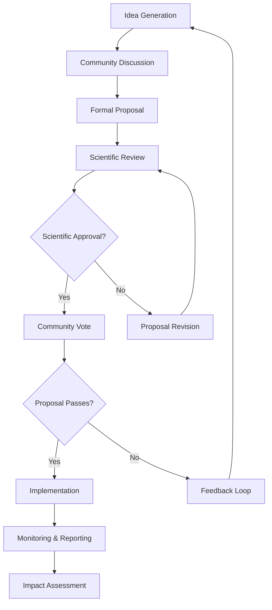

# THEIA Governance Participation Guide

## Your Path to Meaningful Ecological Impact


---

## Table of Contents

1. [Welcome to TheiaDAO](#welcome-to-theiadao)
2. [Getting Started](#getting-started)
3. [Understanding THEIA Tokens](#understanding-theia-tokens)
4. [Locking Your Tokens](#locking-your-tokens)
5. [Governance Process Overview](#governance-process-overview)
6. [Creating Effective Proposals](#creating-effective-proposals)
7. [Voting with Impact](#voting-with-impact)
8. [Delegation Guide](#delegation-guide)
9. [Scientific Oversight System](#scientific-oversight-system)
10. [Governance Resources](#governance-resources)
11. [Frequently Asked Questions](#frequently-asked-questions)

---

## Welcome to TheiaDAO

Welcome to TheiaDAO, a community-governed initiative restoring vital waterways and ecosystems through the alignment of technology, ecological science, and community wisdom. This guide will help you participate effectively in our governance system, whether you're looking to vote on proposals, create new initiatives, or simply better understand how decisions are made.

### Our Governance Philosophy

TheiaDAO is built on these foundational principles:

- **Ecological Alignment**: All governance decisions prioritize ecosystem health
- **Inclusive Participation**: Everyone has a voice, regardless of token holdings
- **Scientific Integrity**: Ecological expertise guides our decision-making
- **Transparent Process**: All governance activities are open and accessible
- **Continuous Improvement**: Our governance system evolves with our learning

Let's begin your journey to becoming an active participant in ecosystem restoration governance!

## Getting Started

### What You'll Need

To participate in THEIA governance, you'll need:

1. **THEIA Tokens**: The governance token that allows participation
2. **Compatible Wallet**: MetaMask, Coinbase Wallet, or another Web3 wallet
3. **Chain Connection**: Connect to Polygon, Optimism, or Avalanche networks
4. **Basic Knowledge**: Understanding of the governance process (this guide helps!)

### Step-by-Step Setup

```
┌───────────────┐      ┌───────────────┐      ┌───────────────┐
│  SET UP YOUR  │  →   │ ACQUIRE THEIA │  →   │ CONNECT WITH  │
│     WALLET    │      │    TOKENS     │      │  GOVERNANCE   │
└───────────────┘      └───────────────┘      └───────────────┘
                                                     ↓
┌───────────────┐      ┌───────────────┐      ┌───────────────┐
│    BEGIN      │  ←   │  LEARN ABOUT  │  ←   │   JOIN THE    │
│ PARTICIPATION │      │  KEY ISSUES   │      │  COMMUNITY    │
└───────────────┘      └───────────────┘      └───────────────┘
```

### Governance Portal Access

Visit [governance.theiadao.io](https://governance.theiadao.io) and connect your wallet to:

- View active proposals
- See your voting power
- Track ecological projects
- Access governance resources
- Connect with the community

## Understanding THEIA Tokens

THEIA tokens represent your stake in the governance system and allow you to participate in decision-making.

### Token Fundamentals

- **Total Supply**: 100,000,000 THEIA tokens
- **Multi-Chain Deployment**: Available on Polygon, Optimism, and Avalanche
- **Governance Rights**: Voting on proposals and ecological decisions
- **Revenue Sharing**: 1% of Vivid Visions revenue distributed to locked token holders
- **Contract Address**: `0x7he1aD40...` (Verify before interactions!)

### Token Acquisition

THEIA tokens can be obtained through:

1. **Community Distribution**: Participation in ecological initiatives
2. **Contribution Rewards**: Contributions to TheiaDAO projects
3. **Ecosystem Partners**: Partnerships with aligned organizations
4. **Secondary Markets**: Exchanges where THEIA is listed (for unlocked tokens)

### Responsible Token Stewardship

As a THEIA token holder, you're a steward of both the governance system and the ecosystems we restore. We encourage:

- **Long-term Thinking**: Lock tokens to demonstrate commitment
- **Informed Participation**: Research proposals before voting
- **Active Engagement**: Join discussions and contribute insights
- **Ecological Alignment**: Support initiatives that benefit ecosystems

## Locking Your Tokens

Locking your THEIA tokens is a cornerstone of our governance system, demonstrating commitment and unlocking additional benefits.

### Why Lock Your Tokens?

- **Increased Voting Power**: Locking enhances your governance influence
- **Revenue Sharing**: Receive a portion of Vivid Visions revenue
- **Alignment Signaling**: Demonstrate your commitment to long-term ecosystem health
- **Community Standing**: Recognition as a committed governance participant

### Locking Options

| Lock Duration | Voting Multiplier | Revenue Share Multiplier | Unlocking Mechanism |
|---------------|-------------------|--------------------------|---------------------|
| Permanent | 2.0x | 1.5x | Governance vote only |
| 4 Years | 1.5x | 1.25x | Time-based or governance |
| 2 Years | 1.25x | 1.1x | Time-based or governance |
| 1 Year | 1.0x | 1.0x | Time-based or governance |

### Step-by-Step Locking Process

1. **Connect Wallet**: Sign in to the governance portal
2. **Select 'Lock Tokens'**: Navigate to the token management section
3. **Choose Parameters**: Select amount and duration
4. **Review Details**: Confirm the locking terms
5. **Sign Transaction**: Approve the smart contract interaction
6. **Verification**: Confirm your tokens appear as locked

### Visual Locking Guide


## Governance Process Overview

THEIA governance follows a structured process designed to be transparent, inclusive, and ecologically sound.

### Governance Flow



### Proposal Categories

THEIA governance encompasses several types of decisions:

| Category | Description | Voting Threshold | Scientific Review |
|----------|-------------|------------------|-------------------|
| Ecological Projects | Restoration initiatives | 50% approval | Required |
| Treasury Allocation | Funding decisions | 60% approval | Required for >$100k |
| Governance Updates | Process changes | 66% approval | Optional |
| Parameter Adjustments | System variables | 50% approval | Required for ecological |
| Emergency Actions | Urgent interventions | 75% approval | Expedited review |

### Governance Calendar

Governance activities follow a predictable rhythm:

- **Weekly**: Community calls and proposal discussions
- **Bi-weekly**: Voting periods open for new proposals
- **Monthly**: Impact reports and treasury updates
- **Quarterly**: Governance retrospectives and system improvements
- **Annual**: Major strategic reviews and scientific assessments

## Creating Effective Proposals

Well-crafted proposals are essential for successful governance participation. Follow these guidelines to create proposals that effectively communicate your ideas.

### Proposal Structure Template

Every successful proposal includes these key elements:

1. **Title**: Clear, concise description of the initiative
2. **Summary**: Brief overview of the proposal (2-3 sentences)
3. **Background**: Context and need for the proposal
4. **Objectives**: Specific, measurable goals
5. **Ecological Impact**: Expected environmental outcomes
6. **Implementation Plan**: How the proposal will be executed
7. **Budget**: Required resources and their allocation
8. **Timeline**: Key milestones and deadlines
9. **Success Metrics**: How outcomes will be measured
10. **Team**: Individuals responsible for implementation

### Proposal Development Process

```
┌───────────────┐      ┌───────────────┐      ┌───────────────┐
│  IDEA STAGE   │  →   │  TEMPERATURE  │  →   │   COMMUNITY   │
│ Initial concept│      │     CHECK     │      │   FEEDBACK    │
└───────────────┘      └───────────────┘      └───────────────┘
                                                     ↓
┌───────────────┐      ┌───────────────┐      ┌───────────────┐
│    FORMAL     │  ←   │   SCIENTIFIC  │  ←   │   PROPOSAL    │
│  SUBMISSION   │      │  CONSULTATION │      │  REFINEMENT   │
└───────────────┘      └───────────────┘      └───────────────┘
```

### Example: Successful Ecological Proposal

**Title**: Willow Creek Riparian Restoration Project

**Summary**: This proposal seeks to restore 2.5 miles of degraded riparian habitat along Willow Creek through native replanting, stream remeandering, and community monitoring.

**Background**: Willow Creek has experienced 85% loss of riparian vegetation due to agricultural practices, leading to erosion, water quality degradation, and habitat loss for 12 native species.

**Objectives**:
- Reestablish 50-foot native vegetation buffers along 2.5 miles of creek
- Restore natural stream morphology through 5 strategic remeandering interventions
- Reduce water temperature by 4°C during summer months
- Reintroduce 3 locally extirpated riparian plant species

**Ecological Impact**: Expected outcomes include improved water quality, enhanced habitat for 15+ bird species, increased native fish populations, and reduced downstream flooding.

**Implementation Plan**: [Detailed restoration methodology]

**Budget**: 125,000 THEIA tokens allocated as follows:
- 70,000 for restoration materials and equipment
- 40,000 for skilled labor and supervision
- 10,000 for monitoring equipment and reporting
- 5,000 for community training and engagement

**Timeline**: 18-month implementation with quarterly milestones

**Success Metrics**: Water quality parameters, vegetation establishment rates, bird and fish species counts, community participation hours

**Team**: Led by River Restoration Working Group with scientific oversight from Dr. Elena Rivera

### Proposal Submission Requirements

To submit a formal proposal, you must:

1. Hold or have delegation of at least 10,000 locked THEIA tokens
2. Complete the proposal template fully
3. Participate in at least one community discussion about your idea
4. Secure preliminary feedback from at least one Scientific Advisor
5. Commit to leading or supporting the proposal implementation

## Voting with Impact

Your vote is a powerful tool for ecological impact. Understanding how voting works helps you maximize your influence.

### Quadratic Voting Explained

THEIA uses quadratic voting to ensure both broad participation and committed engagement:

**Voting Power = √(Locked Tokens) × Lock Duration Multiplier**

This formula means:
- Everyone's vote matters, regardless of holdings
- Large token holders have more influence, but not proportionally
- Long-term commitment (locking) is rewarded with additional influence

### Voting Power Examples

| Locked Tokens | Lock Duration | Traditional Voting Power | Quadratic Voting Power |
|---------------|---------------|--------------------------|------------------------|
| 1,000,000 | Permanent | 1,000,000 | 2,000 |
| 100,000 | 4 Years | 100,000 | 474 |
| 10,000 | 2 Years | 10,000 | 112 |
| 1,000 | 1 Year | 1,000 | 32 |

*This approach significantly reduces power disparities while still recognizing different levels of commitment.*

### How to Vote

1. **Connect Wallet**: Sign in to the governance portal
2. **Browse Proposals**: Review active proposals
3. **Research**: Read proposal details and community discussions
4. **Cast Vote**: Select Yes, No, or Abstain
5. **Confirm**: Sign the transaction with your wallet
6. **Verify**: Check that your vote was recorded

### Responsible Voting Practices

As a governance participant, we encourage these best practices:

- **Read Thoroughly**: Understand proposals before voting
- **Consider Ecological Impact**: Prioritize ecosystem health in decisions
- **Engage in Discussion**: Share your perspective before voting
- **Balanced Approach**: Consider short and long-term implications
- **Respect Scientific Input**: Value the expertise of our Scientific Advisors

## Delegation Guide

Delegation allows you to assign your voting power to trusted representatives when you cannot actively participate.

### Why Delegate?

- **Expertise Gap**: If you're new to ecology or governance
- **Time Constraints**: When you can't actively participate
- **Strategic Alignment**: To support delegates with shared values
- **Specialized Knowledge**: For proposals requiring technical understanding

### Finding the Right Delegate

Consider these factors when choosing a delegate:

1. **Voting History**: Review their past governance participation
2. **Ecological Expertise**: Knowledge relevant to THEIA's mission
3. **Community Engagement**: Active participation in discussions
4. **Value Alignment**: Shared priorities for ecological restoration
5. **Communication Style**: How they explain their decisions

### Featured Delegates

The governance portal highlights delegates who have:
- Participated in at least 80% of votes
- Maintained clear communication about their decisions
- Demonstrated ecological knowledge
- Received positive community feedback

### Delegation Process

1. **Explore Delegates**: Browse delegate profiles and voting records
2. **Select Delegate**: Choose your preferred representative
3. **Set Parameters**: Specify amount, duration, and any conditions
4. **Activate Delegation**: Sign the delegation transaction
5. **Monitor Activity**: Review your delegate's voting decisions
6. **Adjust as Needed**: Change or revoke delegation at any time

### Being an Effective Delegate

If you're interested in becoming a delegate:

1. **Create a Delegate Profile**: Share your expertise and values
2. **Communicate Regularly**: Explain your voting rationale
3. **Engage Actively**: Participate in discussions and working groups
4. **Respect Responsibility**: Vote thoughtfully on behalf of others
5. **Build Knowledge**: Continuously develop your ecological understanding

## Scientific Oversight System

The Scientific Advisory Board plays a crucial role in THEIA governance through the Scientist NFT mechanism.

### Role of Scientific Oversight

Scientists holding special NFTs ensure that governance decisions remain aligned with ecological best practices by:

- **Reviewing Proposals**: Assessing ecological soundness
- **Providing Guidance**: Offering expertise during proposal development
- **Veto Authority**: Blocking proposals that could harm ecosystem health
- **Impact Verification**: Validating the outcomes of restoration projects
- **Knowledge Translation**: Making science accessible to the community

### The Scientist NFT Explained

```
┌───────────────────────────────────────────────────────┐
│                   SCIENTIST NFT                        │
├───────────────────────────────────────────────────────┤
│ • Soulbound token held by ecological experts          │
│ • Grants special governance powers                     │
│ • Multi-signature functionality for collaborative      │
│   decisions                                            │
│ • Transparent on-chain record of scientific review     │
│ • Cannot be transferred or sold                        │
└───────────────────────────────────────────────────────┘
```

### Scientific Review Process

When you submit a proposal, it undergoes this review process:

1. **Initial Consultation**: Early feedback during development
2. **Formal Review**: Assessment once proposal is submitted
3. **Feedback Loop**: Suggestions for improvement if needed
4. **Final Determination**: Approval or veto with explanation
5. **Implementation Guidance**: Ongoing support during execution

### Community-Science Collaboration

Effective governance comes from the productive interaction between community wisdom and scientific knowledge:

- **Community**: Local knowledge, priorities, implementation capacity
- **Scientists**: Ecological expertise, methodological guidance, impact assessment
- **Together**: Sustainable, effective ecological restoration

## Governance Resources

THEIA provides numerous resources to help you become an effective governance participant:

### Learning Resources

| Resource | Description | Audience | Access |
|----------|-------------|----------|--------|
| Governance Academy | Comprehensive learning modules | Beginners | [academy.theiadao.io](https://academy.theiadao.io) |
| Ecological Primer | Introduction to restoration science | All levels | Governance portal |
| Case Study Library | Examples of successful proposals | All levels | Governance portal |
| Advanced Governance | Deep dives into governance mechanics | Experienced | [advanced.theiadao.io](https://advanced.theiadao.io) |

### Community Support

- **Governance Mentors**: Experienced members who can guide newcomers
- **Office Hours**: Regular sessions with the core team to answer questions
- **Proposal Workshops**: Collaborative sessions to develop ideas
- **Regional Meetups**: In-person gatherings to build community

### Technical Tools

- **Governance Simulator**: Practice creating and voting on proposals
- **Voting Calculator**: Understand your voting power
- **Delegation Explorer**: Find and evaluate potential delegates
- **Proposal Templates**: Standardized formats for different proposal types

### Communication Channels

- **Forum**: [forum.theiadao.io](https://forum.theiadao.io) - In-depth discussions
- **Discord**: Real-time community interaction
- **Governance Calls**: Weekly video discussions on active proposals
- **Newsletter**: Monthly updates on governance activities

## Frequently Asked Questions

### General Governance Questions

**Q: How much voting power do I need to create a proposal?**  
A: You need to hold or have delegation of at least 10,000 locked THEIA tokens to create a formal proposal.

**Q: How long do voting periods last?**  
A: Standard voting periods are 5 days, though emergency proposals may have shorter timeframes.

**Q: Can I change my vote after submitting it?**  
A: No, votes are final once submitted to ensure transparency and predictability.

**Q: Who can see my voting history?**  
A: All votes are recorded on-chain and publicly visible, though your identity is linked only to your wallet address.

**Q: What happens if the community approves a proposal but scientists veto it?**  
A: The proposal cannot proceed as written, but can be revised based on scientific feedback and resubmitted.

### Token Locking Questions

**Q: Can I unlock my tokens before the lock period ends?**  
A: No, time-based locks cannot be unlocked early. This commitment mechanism ensures governance stability.

**Q: What happens to my locked tokens if I want to bridge to another chain?**  
A: You'll need to wait until your tokens are unlocked, or use governance to move permanently locked tokens through a formal proposal.

**Q: Do I still earn revenue share if I delegate my tokens?**  
A: Yes, revenue share is based on token ownership and lock status, not on who exercises the voting power.

**Q: What's the minimum amount I can lock?**  
A: You can lock as few as 1 THEIA token, though meaningful governance participation typically begins at higher levels.

### Ecological Impact Questions

**Q: How do I know if my proposal will pass scientific review?**  
A: Consult with a Scientific Advisor during development and review the Ecological Impact Framework for guidance.

**Q: Can I propose a project outside current focus ecosystems?**  
A: Yes, though proposals aligning with strategic focus areas typically receive more support.

**Q: How are restoration outcomes verified?**  
A: Through our comprehensive monitoring framework, including professional assessment, community monitoring, and technological verification.

**Q: Can I visit restoration sites?**  
A: Yes, community site visits are regularly organized for governance participants to witness impact firsthand.

---

*This guide is updated regularly to reflect governance system improvements and community feedback. Last updated: March 2025.*

---

**TheiaDAO: Governing together for ecological regeneration**
