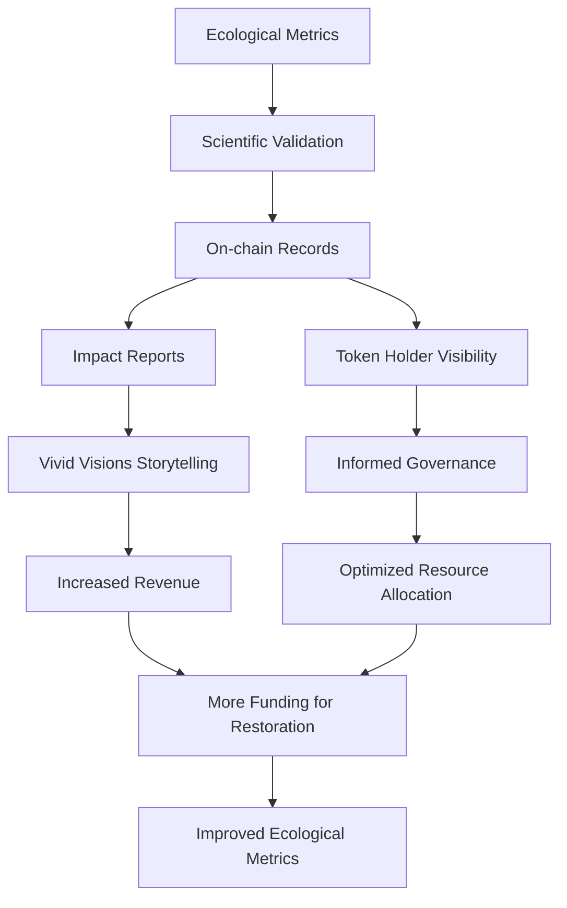
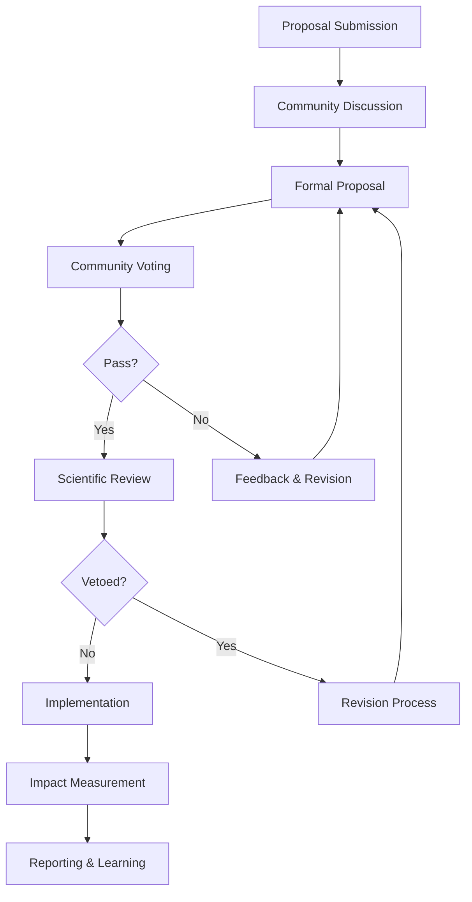

# THEIA Impact Investment Whitepaper
## TheiaDAO: Regenerative Economics for Ecological Restoration

*Version 1.0 - March 2025*

---

## Executive Summary

TheiaDAO represents a paradigm shift in ecological restoration funding through an innovative model that aligns economic incentives with environmental outcomes. This whitepaper outlines how our Vivid Visions creative agency generates sustainable revenue that powers Canopy Culture's ecological restoration initiatives, all governed by the THEIA token system.

By creating this circular economic model, we're demonstrating that ecological regeneration can be financially sustainable while delivering meaningful, measurable impact. The THEIA token enables aligned governance, revenue sharing, and ecosystem participation through a multi-chain implementation that prioritizes accessibility and environmental considerations.

This document presents the economic model, impact measurement framework, and investment thesis for impact-oriented investors seeking both ecological and economic returns.

---

## Table of Contents

1. [Introduction & Vision](#introduction--vision)
2. [Economic Model](#economic-model)
3. [Impact Measurement Framework](#impact-measurement-framework)
4. [Financial Projections](#financial-projections)
5. [Investment Opportunities](#investment-opportunities)
6. [Comparative Analysis](#comparative-analysis)
7. [Risk Assessment & Mitigation](#risk-assessment--mitigation)
8. [Long-term Sustainability](#long-term-sustainability)
9. [Governance Structure](#governance-structure)
10. [Team & Advisors](#team--advisors)
11. [Conclusion](#conclusion)
12. [References & Appendices](#references--appendices)

---

## Introduction & Vision

### The Ecological Crisis

Monoculture farming, industrial development, and climate change have severely degraded vital waterways and ecosystems worldwide. According to the latest data:

- 35% of wetlands have been lost since 1970
- 83% of freshwater species populations have declined
- 90% of the world's rivers are impacted by flow fragmentation or regulation
- Only 17% of rivers are both free-flowing and within protected areas

These statistics represent not just ecological loss but the erosion of essential ecosystem services that support all life on Earth.

### The Funding Gap

Despite growing recognition of these challenges, funding for ecological restoration faces several critical barriers:

1. **Short-term Focus**: Traditional investment models prioritize quarterly returns over long-term ecological timescales
2. **Misaligned Incentives**: Economic rewards rarely align with ecological outcomes
3. **Fragmented Approaches**: Restoration efforts often lack coordination and holistic watershed management
4. **Limited Participation**: Decision-making excludes key stakeholders and affected communities
5. **Scale Challenges**: Successful pilot projects struggle to scale due to funding constraints

### Our Vision: Regenerative Economics in Action

TheiaDAO addresses these challenges through a revolutionary model that connects creative economics with ecological outcomes:

```
┌─────────────────┐     ┌─────────────────┐     ┌─────────────────┐
│  Vivid Visions  │ --> │    TheiaDAO     │ --> │ Canopy Culture  │
│ Creative Agency │     │   Governance    │     │   Ecological    │
│  Revenue Engine │ --> │    (THEIA)      │ --> │  Restoration    │
└─────────────────┘     └─────────────────┘     └─────────────────┘
     Generates          Governs & Allocates      Implements & Measures
      Revenue             Resources based          Ecological Impact
                          on Community Input
```

This model creates a self-reinforcing cycle:
- Vivid Visions generates sustainable revenue through creative services
- THEIA governance directs resources toward high-impact ecological projects
- Canopy Culture implements restoration with scientific oversight
- Measurable ecological improvements create recognition that enhances Vivid Visions' brand value
- Economic returns from ecosystem services benefit all stakeholders

## Economic Model

### Revenue Generation Through Vivid Visions

Vivid Visions operates as a creator and builder agency offering services in:

1. **Digital Creation**: Design, development, and creative direction
2. **Content Production**: Visual storytelling, documentation, and narrative development
3. **Brand Strategy**: Identity development for purpose-driven organizations
4. **Technical Implementation**: Building digital infrastructure and platforms
5. **Impact Communications**: Storytelling for ecological and social initiatives

### Revenue Allocation Model

The economic model allocates revenue through a transparent formula:

| Revenue Category | Operational Costs | Team Compensation | TheiaDAO Treasury | THEIA Token Holders | Canopy Culture |
|------------------|-------------------|-------------------|-------------------|---------------------|----------------|
| Creative Services | 40% | 35% | 10% | 1% | 14% |
| Product Revenue | 30% | 30% | 15% | 1% | 24% |
| Partnership Revenue | 45% | 25% | 15% | 1% | 14% |
| Licensing | 20% | 30% | 25% | 1% | 24% |

*Note: Percentages are current allocations and may be adjusted through governance proposals with scientific oversight approval through the Scientist NFT.*

### Value Flow Visualization

The following diagram illustrates the circular value flow through the ecosystem:


### Comparison With Traditional Models

| Aspect | Traditional Conservation | Crypto-Environmental | TheiaDAO Model |
|--------|--------------------------|----------------------|----------------|
| Funding Source | Donations & Grants | Token Speculation | Sustainable Business Revenue |
| Sustainability | Dependent on Donors | Market Volatility | Self-sustaining |
| Decision Making | Top-down | Token-weighted | Quadratic + Scientific |
| Impact Verification | Periodic Reports | Limited | Real-time, On-chain |
| Economic Alignment | Minimal | Indirect | Direct Through Revenue |

## Impact Measurement Framework

### Ecological Focus Areas

Canopy Culture focuses on watershed restoration with particular emphasis on:

1. **Riparian Zone Rehabilitation**: Restoring the critical interface between land and water
2. **Water Quality Improvement**: Reducing pollutants and improving oxygenation
3. **Biodiversity Enhancement**: Reintroducing and supporting keystone species
4. **Hydrological Restoration**: Improving water flow and natural flood management
5. **Community Engagement**: Involving local stakeholders in restoration and monitoring

### Measurement Methodology

Our impact measurement follows a rigorous scientific methodology:

1. **Baseline Establishment**: Comprehensive ecological assessment before intervention
2. **Indicator Selection**: Science-based indicators for each ecosystem function
3. **Monitoring Protocols**: Standardized techniques for ongoing measurement
4. **Data Verification**: Multi-stakeholder validation of impact data
5. **On-chain Recording**: Transparent, immutable record of ecological outcomes
6. **Third-party Audit**: Independent verification of methodology and results

### Key Performance Indicators

Each restoration project tracks the following core metrics:

| Category | Metrics | Measurement Method | Update Frequency | On-chain Record |
|----------|---------|---------------------|------------------|-----------------|
| Water Quality | pH, dissolved oxygen, temperature, turbidity, pollutant levels | Sensor network, lab testing | Real-time to weekly | Yes |
| Biodiversity | Species richness, population counts, habitat quality index | Field surveys, eDNA sampling | Monthly to quarterly | Yes |
| Hydrology | Flow rate, groundwater levels, flood retention capacity | Gauging stations, LiDAR | Daily to monthly | Yes |
| Carbon | Sequestration rates, soil carbon, biomass | Field sampling, remote sensing | Quarterly | Yes |
| Community | Participation hours, training completions, local employment | Activity tracking | Monthly | Yes |

### From Metrics to Token Value

The connection between ecological metrics and token mechanics creates alignment between governance participation and environmental outcomes:



## Financial Projections

### Revenue Growth Model

Based on market analysis and initial traction, we project the following revenue growth for Vivid Visions:

| Year | Revenue Projection | YoY Growth | Ecological Funding |
|------|---------------------|------------|---------------------|
| 2025 | $5,000,000 | Baseline | $700,000 |
| 2026 | $12,500,000 | 150% | $1,750,000 |
| 2027 | $25,000,000 | 100% | $3,500,000 |
| 2028 | $40,000,000 | 60% | $5,600,000 |
| 2029 | $60,000,000 | 50% | $8,400,000 |

### Restoration Project Economics

The economics of ecological restoration projects show attractive long-term value creation:

| Project Type | Initial Investment | Annual Maintenance | Ecosystem Services Value (10yr) | ROI Timeframe |
|--------------|-------------------|---------------------|--------------------------------|--------------|
| Riparian Buffer Restoration | $50,000/acre | $5,000/acre | $250,000/acre | 5-7 years |
| Wetland Rehabilitation | $75,000/acre | $8,000/acre | $400,000/acre | 4-6 years |
| Stream Remeandering | $100,000/mile | $10,000/mile | $500,000/mile | 5-8 years |
| Floodplain Reconnection | $200,000/project | $20,000/project | $1,200,000/project | 6-9 years |

*Ecosystem services value includes flood mitigation, water purification, carbon sequestration, biodiversity support, and recreational value.*

### Token Value Drivers

The THEIA token derives value from multiple sources:

1. **Governance Utility**: Directing ecological restoration resources
2. **Revenue Share**: 1% of Vivid Visions revenue distributed to locked token holders
3. **Ecological Impact Rights**: Priority access to verified impact credits
4. **Network Participation**: Access to the growing ecosystem of partners

## Investment Opportunities

### For Impact Investors

1. **THEIA Token Acquisition**
   - Participate in governance and revenue sharing
   - Lock tokens for enhanced voting power and rewards
   - Support the ecological mission through aligned governance

2. **Vivid Visions Strategic Investment**
   - Equity in the revenue-generating creative agency
   - Direct exposure to the growth of purpose-driven creative services
   - Participation in the ecosystem's economic engine

3. **Project-Specific Funding**
   - Direct investment in specific ecological restoration projects
   - Returns through ecosystem service credits and impact verification
   - Targeted geographical or ecological focus

### Investment Tiers

| Tier | Investment Range | Governance Rights | Revenue Share | Impact Reporting | Site Access |
|------|------------------|-------------------|---------------|------------------|-------------|
| Seed | $10K-$50K | Basic | Standard | Quarterly | Annual |
| Growth | $50K-$250K | Enhanced | Standard+ | Monthly | Quarterly |
| Keystone | $250K-$1M | Advanced | Premium | Weekly | Monthly |
| Watershed | $1M+ | Leadership | Premium+ | Real-time | Unlimited |

### Paths to Liquidity

Impact investors can realize returns through multiple channels:

1. **Revenue Share Distribution**: Regular distributions from Vivid Visions revenue
2. **Ecosystem Service Credits**: Monetization of carbon and biodiversity credits
3. **Secondary Market**: Token trading for unlocked portions
4. **Strategic Acquisition**: Potential for ecosystem acquisition by larger sustainability initiatives
5. **Impact-linked Instruments**: Innovative financial instruments tied to ecological outcomes

## Comparative Analysis

### Compared to Traditional Conservation Funding

| Aspect | Traditional Philanthropy | Conservation Finance | TheiaDAO Model |
|--------|--------------------------|---------------------|----------------|
| Funding Source | Donations | Impact Investment | Creative Economy |
| Sustainability | Donor Dependent | Performance Dependent | Economically Self-sustaining |
| Scale Potential | Limited by Donations | Limited by Returns | Scales with Creative Economy |
| Governance | Foundation/NGO | Investor/Manager | Community + Scientific |
| Impact Transparency | Periodic Reports | Quarterly/Annual | Real-time, On-chain |
| Innovation Potential | Limited by Risk Aversion | Limited by Return Requirements | High via Community Ideation |

### Compared to Existing Crypto-Environmental Projects

| Project | Token Model | Revenue Source | Ecological Focus | Scientific Validation |
|---------|-------------|----------------|-------------------|------------------------|
| Carbon Credit Projects | Offset Token | Carbon Markets | CO2 Reduction | Third-party Verification |
| Land DAOs | Governance Token | Speculation/Appreciation | Land Conservation | Limited/Variable |
| ReFi Protocols | Bonding Curves | Protocol Fees | Various Environmental | External Oracles |
| Climate Coins | Stablecoin Backed | Reserve Assets | Climate Action | Academic Partnerships |
| THEIA | Locked Governance | Creative Economy | Watershed Restoration | Integrated NFT Oversight |

## Risk Assessment & Mitigation

Responsible investment requires thorough assessment of potential risks and mitigation strategies.

### Market Risks

| Risk Factor | Description | Likelihood | Impact | Mitigation Strategy |
|-------------|-------------|------------|--------|---------------------|
| Creative Market Downturn | Reduction in demand for Vivid Visions services | Medium | High | Diversified service offerings, long-term contracts, counter-cyclical client focus |
| Token Market Volatility | THEIA price fluctuations affecting governance | High | Medium | Focus on locked tokens, treasury reserves, governance stability mechanisms |
| Competitive Pressure | New entrants in ecological restoration | Medium | Medium | First-mover advantage, scientific partnerships, proprietary restoration methodologies |
| Regulatory Changes | Evolving regulations for tokens or restoration | Medium | High | Multi-chain approach, legal compliance framework, jurisdictional diversification |

### Operational Risks

| Risk Factor | Description | Likelihood | Impact | Mitigation Strategy |
|-------------|-------------|------------|--------|---------------------|
| Project Implementation Challenges | Difficulties in ecological restoration execution | Medium | High | Scientific oversight, phased implementation, contingency planning |
| Team Retention | Loss of key team members | Low | High | Equity incentives, purpose alignment, distributed knowledge management |
| Technical Vulnerabilities | Smart contract or bridge security issues | Low | Critical | Multiple audits, phased deployment, insurance coverage |
| Climate Impacts | Extreme weather affecting restoration sites | Medium | High | Resilient design principles, geographical diversification, adaptation protocols |

### Impact Risks

| Risk Factor | Description | Likelihood | Impact | Mitigation Strategy |
|-------------|-------------|------------|--------|---------------------|
| Insufficient Ecological Outcomes | Projects failing to achieve target impact | Low | High | Scientific oversight, adaptive management, data-driven decision making |
| Impact Measurement Challenges | Difficulties in quantifying ecosystem benefits | Medium | Medium | Multiple measurement methodologies, conservative estimates, continuous improvement |
| Community Engagement Shortfalls | Lack of local stakeholder participation | Low | Medium | Community-first design, local partnerships, benefit-sharing mechanisms |
| Greenwashing Concerns | Perception issues around ecological claims | Low | High | Transparent reporting, third-party verification, on-chain impact data |

## Long-term Sustainability

The TheiaDAO model is designed for long-term sustainability through several key mechanisms:

### Ecological Sustainability

1. **Regenerative Focus**: Projects designed to be self-sustaining once established
2. **Keystone Species Approach**: Targeting ecological elements with cascade effects
3. **Community Stewardship**: Local stakeholder engagement ensures ongoing care
4. **Adaptive Management**: Continuous monitoring and response to ecosystem changes
5. **Resilience Design**: Projects built to withstand climate variability and change

### Economic Sustainability

1. **Diversified Revenue**: Multiple service lines within Vivid Visions
2. **Value-capture Mechanisms**: Revenue sharing aligned with ecological outcomes
3. **Treasury Reserves**: Strategic reserves for market downturns and opportunities
4. **Scaling Strategy**: Replicable models that become more efficient at scale
5. **Ecosystem Services Monetization**: Long-term value from restored natural capital

### Governance Sustainability

1. **Progressive Decentralization**: Gradual transfer of control to the community
2. **Scientific Guardrails**: Expert oversight preventing mission drift
3. **Sunset Reviews**: Regular evaluation of governance effectiveness
4. **Cross-chain Implementation**: Resilience against individual chain challenges
5. **Education Pipeline**: Building ecological governance capacity in the community

## Governance Structure

TheiaDAO's governance structure balances community participation with scientific oversight:

### Key Governance Elements

1. **THEIA Token Voting**: Quadratic voting system for proposal decisions
2. **Scientist NFT Oversight**: Veto power for proposals that risk ecological misalignment
3. **Proposal Framework**: Structured process for initiative development and funding
4. **Multi-sig Treasury**: Secure management of ecosystem resources
5. **Impact Verification System**: Validation of ecological outcomes

### Governance Process Flow



### Governance Participation Incentives

| Activity | THEIA Incentive | Impact Connection |
|----------|----------------|-------------------|
| Proposal Creation | Creation rewards | Proposals must include ecological targets |
| Voting | Governance rewards | Voting record tied to impact outcomes |
| Scientific Review | Expert compensation | Direct ecological oversight |
| Impact Verification | Verification rewards | Ensuring accurate impact reporting |
| Community Education | Education rewards | Building governance capacity |

## Team & Advisors

### Core Team

The TheiaDAO initiative is led by a cross-disciplinary team combining expertise in ecology, technology, creative industries, and governance:

*[Team member profiles would be listed here with relevant expertise and backgrounds]*

### Scientific Advisors

Our scientific oversight is provided by leading experts in ecological restoration, hydrology, biodiversity, and climate science:

*[Scientific advisor profiles would be listed here with credentials and specializations]*

### Strategic Advisors

Strategic guidance comes from experienced leaders in impact investment, blockchain governance, creative industries, and conservation:

*[Strategic advisor profiles would be listed here with relevant experience]*

## Conclusion

TheiaDAO represents a novel approach to ecological restoration funding that addresses the fundamental challenges of traditional conservation finance. By creating a self-sustaining economic engine through creative services, aligning governance with scientific oversight, and implementing transparent impact measurement, we've developed a model that can scale with the growing regenerative economy.

The THEIA token sits at the center of this ecosystem, providing the governance mechanism that ensures all stakeholders maintain alignment with our core mission: restoring vital waterways and empowering the regrowth of keystone species of flora and fauna.

For impact investors, TheiaDAO offers a unique opportunity to participate in a system that generates both ecological returns through measurable restoration outcomes and economic returns through revenue sharing and ecosystem service value.

We invite aligned investors to join us in demonstrating that ecological regeneration and economic prosperity can be designed as complementary forces rather than competing interests.

## References & Appendices

### References

*[Citations for scientific data, economic models, and ecosystem service valuations would be listed here]*

### Appendices

#### Appendix A: Detailed Tokenomics Model
*[Detailed breakdown of token distribution, vesting, and economic modeling]*

#### Appendix B: Ecological Methodology Documentation
*[Scientific methodology for restoration approaches and measurement protocols]*

#### Appendix C: Legal Structure and Compliance Framework
*[Overview of legal entities, regulatory approach, and compliance mechanisms]*

#### Appendix D: Case Studies of Pilot Projects
*[Documentation of initial restoration projects, outcomes, and lessons learned]*

---

*This whitepaper is a living document that will be updated as the TheiaDAO ecosystem evolves. For the latest version, please visit [theiadao.io/whitepaper](https://theiadao.io/whitepaper).*

*Disclaimer: This document contains forward-looking statements that involve risks and uncertainties. Actual results may differ materially from those anticipated in these statements.*
