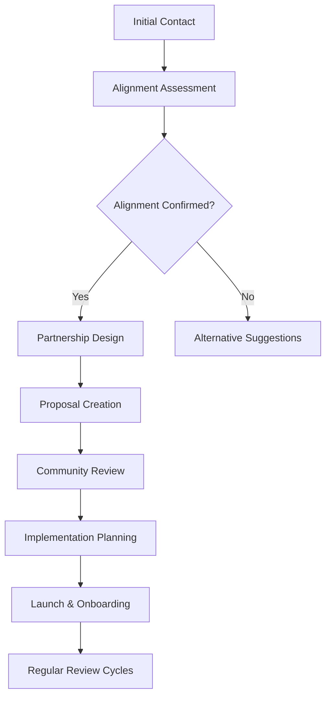

# THEIA Partnership Opportunities

## Building a Regenerative Ecosystem Together

The THEIA ecosystem presents unique partnership opportunities for organizations and individuals who share our vision of ecological restoration through aligned governance and economic models. This document outlines the various ways partners can engage with TheiaDAO, Vivid Visions, and Canopy Culture.

## Table of Contents

1. [Partnership Philosophy](#partnership-philosophy)
2. [Partnership Categories](#partnership-categories)
3. [Vivid Visions Integration](#vivid-visions-integration)
4. [Canopy Culture Collaborations](#canopy-culture-collaborations)
5. [TheiaDAO Ecosystem Integration](#theiadao-ecosystem-integration)
6. [Benefits & Value Exchange](#benefits--value-exchange)
7. [Partnership Process](#partnership-process)
8. [Current Partners](#current-partners)
9. [Contact Information](#contact-information)

## Partnership Philosophy

Our approach to partnerships is guided by three core principles:

1. **Ecological Alignment**: All partnerships must contribute positively to our mission of ecosystem restoration.
2. **Mutual Value Creation**: Partnerships should create meaningful value for all participants and stakeholders.
3. **Long-term Relationships**: We focus on sustained collaborations rather than short-term transactions.


## Partnership Categories

### 🌱 Ecological Partners

Organizations directly involved in environmental restoration, conservation, and ecological research.

**Examples include:**
- Conservation organizations
- Environmental research institutions
- Indigenous communities managing traditional lands
- Regenerative agriculture projects
- Marine and freshwater restoration initiatives

### 🏢 Corporate Sponsors

Businesses seeking to support ecological restoration while gaining visibility and impact credentials.

**Examples include:**
- Sustainability-focused companies
- B-Corps and social enterprises
- ESG-conscious corporations
- Impact investors
- Corporate social responsibility programs

### 🛠️ Technology Partners

Organizations providing technical solutions and infrastructure to support the THEIA ecosystem.

**Examples include:**
- Blockchain infrastructure providers
- Environmental monitoring tech companies
- Data analytics platforms
- IoT sensor networks for ecological monitoring
- Scientific instrumentation companies

### 🎓 Academic & Research Partners

Institutions that provide scientific expertise, validation, and research collaboration.

**Examples include:**
- Universities and research institutions
- Scientific foundations
- Environmental policy think tanks
- Conservation biology programs
- Climate science organizations

### 🌐 Community & Cultural Partners

Organizations that help engage communities and promote cultural dimensions of ecological restoration.

**Examples include:**
- Indigenous knowledge keepers
- Local community organizations
- Arts and cultural institutions
- Educational programs
- Environmental justice organizations

## Vivid Visions Integration

### Service Integration Opportunities

Vivid Visions, our creator and builder agency, offers multiple integration points for partners:

| Integration Type | Description | Partner Benefits | Application Process |
|------------------|-------------|------------------|---------------------|
| Creative Services Client | Access Vivid Visions' creative services | Preferred rates, impact attribution | [Apply as Client](https://vividvisions.io/partners) |
| Technology Provider | Provide tools used in Vivid Visions workflows | Revenue, case studies, exposure | [Submit Technology](https://vividvisions.io/tech-partners) |
| Skill Provider | Offer specialized skills to the Vivid network | Project opportunities, network access | [Join Talent Network](https://vividvisions.io/talent) |
| Co-Branded Initiatives | Create impact-focused campaigns together | Shared storytelling, aligned marketing | [Propose Collaboration](https://vividvisions.io/collabs) |

### Revenue Sharing Model

Partners who help expand Vivid Visions' business can participate in our unique revenue sharing approach:

```
Partner-referred business
        ↓
Revenue generated through Vivid Visions
        ↓
Partner receives 10% referral fee
        ↓
1% flows to THEIA token holders
        ↓
Additional 5% allocated to Canopy Culture initiatives
```

## Canopy Culture Collaborations

### Ecological Project Partnerships

Organizations can partner directly with Canopy Culture on watershed restoration initiatives:

| Partnership Level | Contribution Range | Project Involvement | Recognition Benefits |
|-------------------|---------------------|---------------------|---------------------|
| Seedling | $10,000 - $50,000 | Single project support | Digital recognition, impact reports |
| Sapling | $50,000 - $250,000 | Feature implementation | Branded content, site visits |
| Mature Tree | $250,000 - $1,000,000 | Key ecosystem element | Co-branded research, naming rights |
| Keystone | $1,000,000+ | Watershed transformation | Full ecosystem storytelling, major recognition |

### Scientific Collaboration Framework

Research organizations can collaborate with Canopy Culture through:

1. **Data Sharing Agreements**: Exchange ecological monitoring data
2. **Field Research Support**: Gain access to restoration sites for research
3. **Co-Published Studies**: Collaborate on peer-reviewed research
4. **Technology Testing**: Use restoration sites for testing monitoring technologies
5. **Fellowship Programs**: Place researchers within Canopy Culture projects

## TheiaDAO Ecosystem Integration

### Governance Participation Options

Partners can engage with TheiaDAO governance through several structured approaches:

| Governance Role | Description | Requirements | Benefits |
|-----------------|-------------|--------------|----------|
| Observer | Monitor governance without participation | None | Ecosystem awareness |
| Delegate | Receive delegation from token holders | Application + expertise | Influence without capital |
| Proposal Sponsor | Support community proposals | THEIA token stake | Recognition, proposal priority |
| Domain Expert | Provide expertise in specific areas | Verified credentials | Advisory compensation, reputation |
| Ecosystem Representative | Represent aligned organizations | Organization endorsement | Cross-organizational alignment |

### Technical Integration Pathways

Technology partners can integrate with the THEIA ecosystem through:

1. **API Access**: Connect systems to THEIA impact data
2. **Oracle Provider**: Provide verified environmental data to the DAO
3. **Tooling Developer**: Build governance and impact tools
4. **Infrastructure Support**: Support multi-chain infrastructure
5. **Analytics Partner**: Provide insights on governance and impact

## Benefits & Value Exchange

### For Ecological Partners

- **Funding Access**: Pathway to TheiaDAO funding for restoration projects
- **Technical Support**: Access to technological infrastructure for monitoring
- **Community Support**: Engagement with the THEIA community
- **Visibility**: Showcasing of projects and impact
- **Scientific Validation**: Connection to scientific oversight board

### For Corporate Partners

- **Measurable Impact**: Directly traceable ecological restoration outcomes
- **ESG Credentials**: Verifiable environmental contributions
- **Content & Storytelling**: Compelling narratives about ecological impact
- **Community Engagement**: Connection with sustainability-focused audience
- **Innovation Showcase**: Demonstration of commitment to novel solutions

### For Technology Partners

- **Real-world Testing**: Apply technologies in active restoration projects
- **Showcase Opportunities**: Demonstrate solutions to engaged community
- **Integration Revenue**: Generate revenue through ecosystem integrations
- **Impact Credentials**: Demonstrate ecological applications of technology
- **Development Feedback**: Receive input from scientific and ecological experts

## Partnership Process



### 1. Initial Contact
Submit your partnership interest through our [partnership portal](https://theiadao.io/partners) or contact partners@theiadao.io.

### 2. Alignment Assessment
Our team reviews your organization and proposal for alignment with our ecological mission and values.

### 3. Partnership Design
We collaboratively design a partnership structure that maximizes mutual value and impact.

### 4. Community Review
Significant partnerships are presented to the TheiaDAO community for feedback and input.

### 5. Implementation
We execute partnership agreements and begin collaborative work.

### 6. Review Cycles
Regular assessment of partnership outcomes ensures continued alignment and impact.

## Current Partners

### Ecological Partners
- Watershed Regeneration Alliance
- Biodiversity Monitoring Consortium
- Indigenous Land Stewardship Network
- Riparian Restoration Institute

### Corporate Sponsors
- EcoTech Innovations
- Regenerative Capital Partners
- Sustainable Supply Chain Collective
- Green Energy Transitions Fund

### Technology Partners
- Environmental Sensor Networks
- Blockchain for Climate Foundation
- Ecological Data Commons
- Regenerative Finance Protocol

## Contact Information

**Partnership Inquiries:** partners@theiadao.io
**Ecological Collaborations:** ecology@canopyculture.io
**Creative Services:** creative@vividvisions.io
**Technical Integrations:** tech@theiadao.io

---

*This document is regularly updated as our partnership opportunities evolve. Last updated: March 2025.*

*All partnerships are subject to ecological alignment verification and community governance approval where applicable.*
