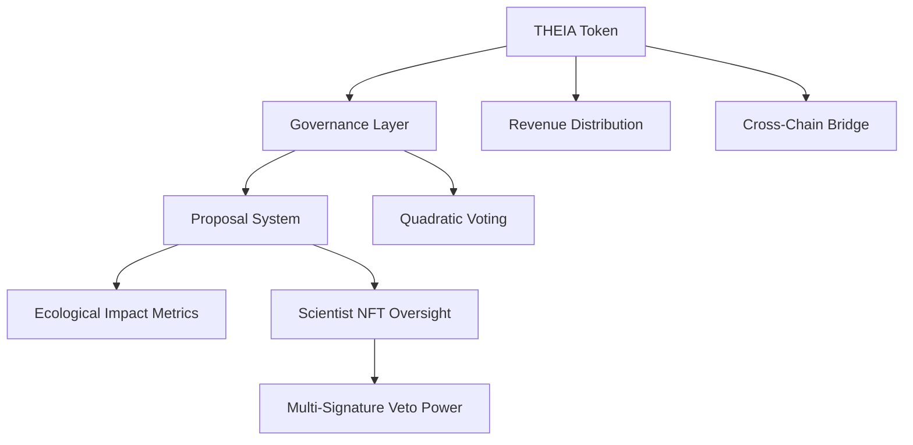

# 🌿 THEIA Governance Token

> *"Regenerating ecosystems through aligned governance and collective impact"*

## 🌍 Reimagining Ecological Governance

THEIA isn't just another governance token. It's the backbone of a revolutionary system where technology, community, and ecological restoration converge. As the governance layer for TheiaDAO, THEIA empowers holders to direct the future of ecosystem regeneration while aligning incentives across stakeholders.

**Our mission**: Leverage blockchain technology to restore vital waterways and empower the regrowth of keystone species of flora and fauna devastated by monoculture farming and environmental degradation.

## ✨ What Makes THEIA Different?

### 🔒 Locked-by-Design
THEIA tokens can be locked for governance participation, creating a community of committed stewards rather than speculative traders. The token is designed to incentivize long-term thinking and ecological alignment.

### 🌊 Multi-Chain, Like Nature Itself
Just as ecosystems don't recognize artificial boundaries, THEIA operates seamlessly across Polygon, Optimism, and Avalanche, creating a fluid governance system that leverages the strengths of each chain.

### 📈 Quadratic Voting That Amplifies Every Voice
Our governance system uses quadratic voting, ensuring that wealth doesn't equal control. Small holders have meaningful input while still rewarding larger supporters.

### 🔬 Scientific Oversight Through NFT Innovation
The Scientist NFT represents a groundbreaking approach to ecological governance. Real scientists hold soulbound NFTs with veto power to ensure proposals align with proven ecological principles.

### 💧 Revenue Sharing That Grows With Impact
1% of protocol revenue flows directly to locked token holders, creating a sustainable economic model that rewards governance participation. As Vivid Visions grows, so does the value returned to the community.

## 🛠️ Technical Architecture

### Key Components:

- **THEIAToken**: ERC20-compatible token with locking, governance, and revenue-sharing capabilities
- **ScientistNFT**: Soulbound tokens for ecological oversight with multi-signature capabilities
- **TheiaCrossChainManager**: Seamless operation across Polygon, Optimism, and Avalanche

## 🌱 The Ecosystem

### 🎨 Vivid Visions
The creator and builder agency that generates revenue for ecosystem regeneration.

### 🌳 Canopy Culture
Our ecological regeneration branch focusing on restoring vital waterways and reintroducing keystone species.

### 🏛️ TheiaDAO
The governance layer that directs resources and strategy, powered by the THEIA token.

## 📊 Impact Metrics

THEIA takes ecological impact seriously. Our on-chain impact metrics create transparent accountability:

- Water quality improvement percentages
- Biodiversity index increases
- Carbon sequestration metrics
- Community participation metrics

## 📄 Smart Contracts

- [THEIA Token Contract](https://github.com/TheiaDAO/contracts/blob/main/THEIAToken.sol)
- [Scientist NFT Contract](https://github.com/TheiaDAO/contracts/blob/main/ScientistNFT.sol)
- [Cross-Chain Manager](https://github.com/TheiaDAO/contracts/blob/main/TheiaCrossChainManager.sol)

## 🚀 How to Participate

### For Investors
Join us in creating a new model for ecological regeneration with sustainable economics. Our revenue-sharing model and multi-chain approach create opportunities for growth while contributing to essential ecosystem restoration.

### For Community Members
Lock your THEIA tokens to participate in governance, earn revenue share, and help guide the future of ecological regeneration. Every voice matters in TheiaDAO.

### For Scientists and Ecologists
Bring your expertise to our ecosystem by becoming a Scientific Advisor. Help guide proposals and ensure ecological alignment.

## 🌟 Roadmap

- **Q2 2025**: Token launch on Polygon
- **Q3 2025**: Cross-chain expansion to Optimism and Avalanche
- **Q4 2025**: First major ecological restoration project funding
- **Q1 2026**: Impact metrics dashboard and reporting system
- **Q2 2026**: Expanded scientific oversight council

## 🔗 Connect and Learn More

- [Website](https://theiadao.io)
- [Discord](https://discord.gg/theiadao)
- [Twitter](https://twitter.com/TheiaDAO)
- [Medium](https://medium.com/theiadao)

---

<strong>Join us in regenerating ecosystems, one token at a time.</strong> 
TheiaDAO © 2025

