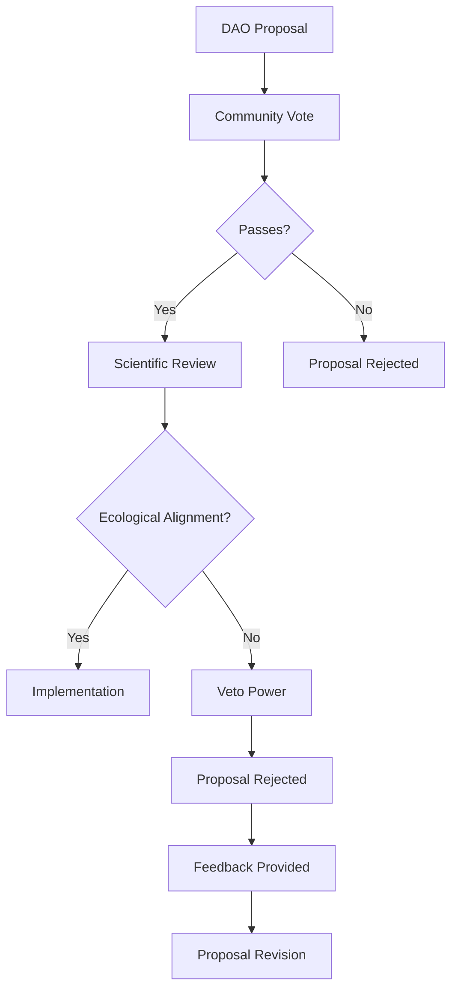

# THEIA Scientific Advisory Board Profiles

## The Guardians of Ecological Alignment

The Scientific Advisory Board is a cornerstone of TheiaDAO's governance structure, providing expert oversight through the innovative Scientist NFT mechanism. This document introduces the distinguished scientists who hold these soulbound tokens and their critical role in ensuring all governance decisions remain aligned with sound ecological principles.

## Table of Contents

1. [Role and Responsibilities](#role-and-responsibilities)
2. [Selection Process](#selection-process)
3. [Current Board Members](#current-board-members)
4. [Multi-Signature Governance](#multi-signature-governance)
5. [Research Initiatives](#research-initiatives)
6. [Ecological Focus Areas](#ecological-focus-areas)
7. [Public Engagement](#public-engagement)
8. [Publications and Resources](#publications-and-resources)

## Role and Responsibilities

The Scientific Advisory Board serves as the ecological conscience of TheiaDAO, with significant responsibilities:

### Primary Functions

- **Governance Oversight**: Review and potentially veto proposals that could compromise ecological integrity
- **Impact Verification**: Validate ecological outcomes and measurement methodologies
- **Strategic Guidance**: Provide scientific direction for restoration priorities
- **Knowledge Translation**: Make complex ecological concepts accessible to the community
- **Research Leadership**: Guide original research on restoration effectiveness

### The Scientist NFT Mechanism

Board members hold soulbound Scientist NFTs that grant special governance powers:

## Selection Process

Scientific Advisory Board members are selected through a rigorous process that ensures the highest standards of expertise and integrity.

### Selection Criteria

| Criterion | Description | Weight |
|-----------|-------------|--------|
| Academic Credentials | Advanced degrees in relevant ecological fields | Essential |
| Research Experience | Significant peer-reviewed publications | High |
| Field Experience | Hands-on restoration work | High |
| Interdisciplinary Background | Knowledge across multiple relevant disciplines | Medium |
| Communication Skills | Ability to translate science for diverse audiences | Medium |
| Alignment with Mission | Demonstrated commitment to ecological restoration | Essential |

### Appointment Process

1. **Nomination**: Candidates are nominated by existing board members or the community
2. **Application Review**: Credentials and alignment assessment
3. **Community Introduction**: Public presentation of expertise and vision
4. **Governance Vote**: Confirmation by TheiaDAO governance
5. **NFT Issuance**: Soulbound Scientist NFT minted and assigned
6. **Onboarding**: Integration into governance and oversight processes

## Current Board Members

### Dr. Elena Rivera, Ph.D. - Chair
*Watershed Ecologist & Riparian Restoration Specialist*

**Expertise**: Integrated watershed management, riparian zone restoration, hydrological connectivity

**Background**: Dr. Rivera brings 15 years of experience leading watershed restoration projects across three continents. Her pioneering work on "Ecological Pulse Restoration" has transformed how we understand river system recovery timelines.

**Academic Credentials**:
- Ph.D. in Watershed Ecology, Stanford University
- M.S. in Environmental Engineering, MIT
- B.S. in Biology, University of California, Berkeley

**Notable Publications**:
- "Restoration Thresholds in Degraded Riparian Systems" (Nature, 2022)
- "Ecological Memory in River Restoration" (Restoration Ecology, 2020)
- Author of "Rivers Remember: The Science of Watershed Healing" (2021)

**Scientist NFT Role**: Primary oversight for water-related governance proposals

---

### Dr. Marcus Chen, Ph.D.
*Biodiversity Specialist & Systems Ecologist*

**Expertise**: Biodiversity monitoring, trophic cascades, keystone species reintroduction

**Background**: Dr. Chen has dedicated his career to understanding and restoring biodiversity in compromised ecosystems. His work with indicator species has created new frameworks for measuring ecosystem health.

**Academic Credentials**:
- Ph.D. in Conservation Biology, Yale University
- M.S. in Wildlife Ecology, University of Wisconsin
- B.S. in Environmental Science, Cornell University

**Notable Projects**:
- Designed the "BioDiversity Pulse" monitoring system used in 40+ countries
- Led the keystone predator reintroduction program in the Pacific Northwest
- Pioneered eDNA monitoring techniques for aquatic biodiversity assessment

**Scientist NFT Role**: Biodiversity impact verification and monitoring protocol design

---

### Dr. Amara Okafor, Ph.D.
*Soil Microbiologist & Regenerative Agriculture Expert*

**Expertise**: Soil microbiome restoration, mycorrhizal networks, agricultural transition systems

**Background**: Dr. Okafor's groundbreaking research on soil microbial communities has revolutionized our understanding of below-ground ecosystem recovery. Her work bridges the gap between agricultural systems and natural ecosystem restoration.

**Academic Credentials**:
- Ph.D. in Soil Microbiology, Wageningen University
- M.S. in Sustainable Agriculture, UC Davis
- B.S. in Biochemistry, University of Nigeria

**Notable Innovations**:
- Developed the "Soil Microbiome Recovery Index" now standard in restoration science
- Created pioneering techniques for rapid mycorrhizal network establishment
- Holds three patents for sustainable soil amendment technologies

**Scientist NFT Role**: Agricultural transition and soil ecosystem restoration oversight

---

### Dr. James Running Deer, Ph.D.
*Indigenous Ecology & Traditional Ecological Knowledge Specialist*

**Expertise**: Integration of traditional ecological knowledge, cultural restoration practices, indigenous stewardship models

**Background**: Dr. Running Deer brings critical perspectives on indigenous ecological knowledge to watershed restoration. His work emphasizes cultural continuity as essential for true ecological healing.

**Academic Credentials**:
- Ph.D. in Ethnobotany, University of British Columbia
- M.S. in Restoration Ecology, University of Washington
- B.A. in Environmental Studies, Haskell Indian Nations University

**Notable Contributions**:
- Author of "Remembering the Land: Indigenous Science in Ecological Restoration"
- Developed the "Cultural Keystone Species" framework for restoration prioritization
- Founded the Indigenous Watershed Guardians network spanning 12 countries

**Scientist NFT Role**: Cultural integration and indigenous knowledge validation

---

### Dr. Sofia Patel, Ph.D.
*Climate Adaptation & Resilience Specialist*

**Expertise**: Climate resilience in restoration design, adaptive management systems, ecological forecasting

**Background**: Dr. Patel ensures TheiaDAO's restoration efforts are designed for long-term resilience in the face of climate change. Her expertise in predictive modeling helps future-proof ecological investments.

**Academic Credentials**:
- Ph.D. in Climate Science, ETH Zürich
- M.S. in Ecological Modeling, Imperial College London
- B.S. in Environmental Systems, UC San Diego

**Notable Research**:
- Developed the "Adaptive Restoration Framework" for climate-resilient project design
- Led the Global Restoration Resilience Initiative across 30 countries
- Pioneer in integrating climate forecasting with restoration planning

**Scientist NFT Role**: Climate resilience verification and adaptive management oversight

## Multi-Signature Governance

The Scientific Advisory Board utilizes a sophisticated multi-signature system through their Scientist NFTs:

### Veto Threshold System

Different proposal categories have different scientific oversight requirements:

| Proposal Category | Veto Threshold | Review Period | Override Possibility |
|-------------------|----------------|---------------|----------------------|
| Standard Funding (<$100K) | 1 Scientist NFT | 3 Days | No |
| Major Funding (>$100K) | 2 Scientist NFTs | 5 Days | No |
| Methodology Changes | 2 Scientist NFTs | 7 Days | No |
| Parameter Updates | 1 Scientist NFT | 3 Days | Community supermajority |
| Emergency Actions | 1 Scientist NFT | 24 Hours | No |

### Decision Framework

Scientific review follows a structured process to ensure consistent ecological oversight:

1. **Ecological Impact Assessment**: Evaluation of potential environmental effects
2. **Scientific Validity Check**: Review of methodological soundness
3. **Alignment Verification**: Confirmation of alignment with restoration principles
4. **Risk Analysis**: Identification of potential unintended consequences
5. **Knowledge Gap Identification**: Recognition of areas requiring further research
6. **Recommendation Formulation**: Clear guidance for governance decisions

## Research Initiatives

The Scientific Advisory Board leads several research initiatives to advance restoration science and practice:

### Current Research Programs

1. **Watershed Recovery Metrics Project**
   - Developing standardized metrics for watershed health assessment
   - Creating benchmarks for restoration success at different timescales
   - Building an open-source database of restoration outcomes

2. **Biodiversity Monitoring Innovation Lab**
   - Testing novel approaches to biodiversity monitoring
   - Validating eDNA and remote sensing technologies
   - Creating cost-effective monitoring protocols for community implementation

3. **Climate Resilience in Restoration Design**
   - Modeling climate impacts on restoration projects
   - Developing adaptive management frameworks
   - Testing resilience-focused restoration techniques

4. **Economic Valuation of Ecosystem Services**
   - Quantifying the economic value of restored watersheds
   - Developing methodologies for valuing biodiversity returns
   - Creating frameworks for monetizing ecological improvements

## Ecological Focus Areas

The Scientific Advisory Board provides guidance across several key ecological domains:

### Priority Ecosystems

1. **Riparian Corridors**
   - River and stream bank restoration
   - Floodplain reconnection
   - Vegetation buffer establishment
   - Fish habitat enhancement

2. **Wetland Systems**
   - Wetland reconstruction
   - Hydrological restoration
   - Native plant reintroduction
   - Water quality improvement

3. **Agricultural Transition Zones**
   - Conversion from monoculture to regenerative systems
   - Agroforestry implementation
   - Soil health restoration
   - Water management optimization

4. **Urban Watershed Interfaces**
   - Urban stream daylighting
   - Green infrastructure integration
   - Community-accessible waterways
   - Urban biodiversity enhancement

### Keystone Species Focus

The board emphasizes the restoration of keystone species that create cascade effects:

| Ecosystem Type | Keystone Flora | Keystone Fauna | Ecological Function |
|----------------|----------------|----------------|---------------------|
| Riparian Forests | Native willows, alders, cottonwoods | Beaver, salmon | Habitat creation, nutrient cycling |
| Wetlands | Sedges, rushes, cattails | Amphibians, waterfowl | Water filtration, insect control |
| Floodplains | Oak savanna species, native grasses | Ungulates, pollinators | Soil building, seed dispersal |
| Headwaters | Mosses, riparian shrubs | Native trout, aquatic insects | Water temperature regulation, leaf processing |

## Public Engagement

The Scientific Advisory Board is committed to making ecological science accessible and engaging for the broader community:

### Knowledge Translation Activities

1. **Monthly Science Briefings**
   - Live-streamed presentations on ecological concepts
   - Q&A sessions with board members
   - Accessible explanations of complex restoration principles

2. **Field Demonstration Days**
   - On-site tours of restoration projects
   - Hands-on learning opportunities
   - Visual documentation of ecological transformation

3. **Citizen Science Programs**
   - Community monitoring protocols
   - Data collection training
   - Participatory research opportunities

4. **Educational Resources**
   - Restoration guides for different ecosystems
   - Identification materials for key species
   - Monitoring protocols for community use

## Publications and Resources

The Scientific Advisory Board produces various materials to share knowledge and insights:

### Research Publications

| Title | Authors | Publication | Year | Focus Area |
|-------|---------|------------|------|------------|
| "Integrated Metrics for Watershed Restoration Success" | Rivera, E., Chen, M., et al. | Journal of Ecological Restoration | 2024 | Monitoring |
| "Indigenous Knowledge Integration in Modern Restoration" | Running Deer, J., Okafor, A., et al. | Ecological Applications | 2023 | Cultural Restoration |
| "Climate-Resilient Design Principles for Watershed Projects" | Patel, S., Rivera, E., et al. | Restoration Ecology | 2024 | Climate Adaptation |
| "Soil Microbiome Recovery Following Agricultural Transition" | Okafor, A., Chen, M., et al. | Soil Biology & Biochemistry | 2023 | Agricultural Systems |

### Practical Guides

1. **Watershed Restoration Handbook**: Comprehensive guide to restoring different watershed elements
2. **Monitoring Protocol Toolkit**: Step-by-step guides for ecological monitoring
3. **Adaptive Management Framework**: Decision support for ecological restoration projects
4. **Community Engagement Playbook**: Methods for involving stakeholders in restoration

### Online Resources

All Scientific Advisory Board materials are available through:
- TheiaDAO Knowledge Repository: [knowledge.theiadao.io](https://knowledge.theiadao.io)
- Restoration Science Open Database: [restorationscience.org](https://restorationscience.org)
- Quarterly Ecological Briefings: [theiadao.io/science](https://theiadao.io/science)

---

## Connect With Our Scientific Advisors

The Scientific Advisory Board welcomes collaboration and knowledge exchange. Contact:
- **General Inquiries**: science@theiadao.io
- **Research Collaboration**: research@theiadao.io
- **Speaking Requests**: speakers@theiadao.io
- **Media Inquiries**: media@theiadao.io

---

*This document is updated quarterly to reflect changes in the Scientific Advisory Board composition and focus areas. Last updated: March 2025.*

*Scientist NFT holders are committed to transparency in their governance roles. All veto actions and scientific recommendations are recorded on-chain and accessible through the TheiaDAO governance portal.*
