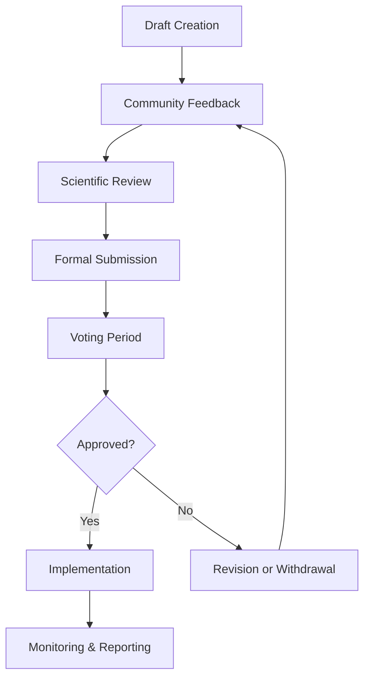

# THEIA Technical Onboarding Guide

## Using Wallets, Governance Systems & Technical Tools

---

## Table of Contents

1. [Introduction](#introduction)
2. [Setting Up Your Wallet](#setting-up-your-wallet)
3. [Getting THEIA Tokens](#getting-theia-tokens)
4. [Connecting to Supported Networks](#connecting-to-supported-networks)
5. [Locking Your Tokens](#locking-your-tokens)
6. [Navigating the Governance Portal](#navigating-the-governance-portal)
7. [Participating in Voting](#participating-in-voting)
8. [Creating & Submitting Proposals](#creating--submitting-proposals)
9. [Using Technical Monitoring Tools](#using-technical-monitoring-tools)
10. [Mobile App Guide](#mobile-app-guide)
11. [Troubleshooting Common Issues](#troubleshooting-common-issues)
12. [Security Best Practices](#security-best-practices)
13. [Getting Help](#getting-help)

---

## Introduction

Welcome to the technical side of TheiaDAO! This guide will walk you through the practical steps needed to participate in our ecosystem restoration governance. Whether you're new to blockchain technology or an experienced user, you'll find clear instructions for setting up your wallet, managing tokens, and engaging with our governance systems.

Our technical infrastructure is designed with these principles in mind:

- **Accessibility**: Making participation possible regardless of technical background
- **Security**: Protecting your assets and our community governance
- **Multi-chain Flexibility**: Working across Polygon, Optimism, and Avalanche
- **Minimal Friction**: Reducing technical barriers to ecological participation
- **Progressive Learning**: Starting simple with options to engage more deeply

Let's get started on your journey to becoming an active participant in TheiaDAO!

## Setting Up Your Wallet

A Web3 wallet is your digital identity in TheiaDAO, allowing you to hold tokens, vote on proposals, and interact with our ecosystem.

### Recommended Wallet Options

| Wallet | Best For | Platforms | Multi-Chain Support | Key Features |
|--------|----------|-----------|---------------------|--------------|
| MetaMask | Most users | Browser, Mobile | Yes | Widespread adoption, good documentation |
| Coinbase Wallet | Beginners | Browser, Mobile | Yes | User-friendly, strong recovery options |
| Rainbow | Mobile users | iOS, Android | Yes | Beautiful interface, easy token management |
| Brave Wallet | Privacy-focused | Brave Browser | Yes | Built-in browser integration |
| Frame | Advanced users | Desktop | Yes | Hardware wallet support, self-custody focus |

### Step-by-Step MetaMask Setup (Recommended for Most Users)

1. **Installation**
   - Visit [metamask.io](https://metamask.io) or search for MetaMask in your browser's extension store
   - Click "Download" and follow browser prompts to install the extension
   - Once installed, the fox icon will appear in your browser toolbar

2. **Wallet Creation**
   - Click the MetaMask icon and select "Create a Wallet"
   - Create a password for your wallet (different from your seed phrase)
   - Review important security information presented by MetaMask

3. **Securing Your Seed Phrase** (CRITICALLY IMPORTANT)
   - MetaMask will show you a 12-word seed phrase
   - Write this down on paper and store it securely offline
   - Never share this phrase with anyone or store it digitally
   - Verify your seed phrase when prompted
   
   > ⚠️ **IMPORTANT**: Your seed phrase is the only way to recover your wallet if you lose access. If someone gets your seed phrase, they can access all your assets. TheiaDAO staff will NEVER ask for your seed phrase.

4. **Basic Wallet Configuration**
   - Your wallet is now created with an Ethereum address
   - The address looks like: 0x7E5F4552091A69125d5DfCb7b8C2659029395Bdf
   - This same address will work across all supported networks

### Mobile Wallet Setup

If you prefer using a mobile device, the process is similar:

1. Download your chosen wallet app from the App Store or Google Play
2. Follow the in-app instructions to create a new wallet
3. Secure your seed phrase using physical paper storage
4. Complete the wallet setup process

### Hardware Wallet Integration (Recommended for Security)

For enhanced security, consider using a hardware wallet like Ledger or Trezor:

1. Purchase the hardware wallet directly from the manufacturer
2. Follow the manufacturer's instructions to set up the device
3. Connect your hardware wallet to MetaMask using the "Connect Hardware Wallet" option
4. Follow the prompts to complete the connection

## Getting THEIA Tokens

THEIA tokens are required for participating in governance. Here's how to acquire them:

### Current Acquisition Methods

| Method | Description | Best For | Process |
|--------|-------------|----------|---------|
| Community Distribution | Tokens allocated for ecological participation | Active community members | Participate in restoration activities and governance |
| Contribution Rewards | Tokens awarded for specific contributions | Skilled contributors | Complete tasks listed in the contribution marketplace |
| Ecosystem Partners | Tokens distributed through partnership programs | Organizational participants | Apply through the partnership portal |
| Secondary Markets | Exchange-based acquisition (for unlocked tokens) | Those seeking immediate access | Use supported exchanges listed below |

### Community Distribution Process

1. **Visit** [community.theiadao.io](https://community.theiadao.io)
2. **Browse** available participation opportunities
3. **Register** for specific restoration activities or governance roles
4. **Participate** in the selected opportunities
5. **Receive** THEIA tokens based on contribution level
6. **Claim** tokens to your wallet through the community portal

### Contribution Marketplace

1. **Access** the contribution marketplace through the governance portal
2. **Browse** available tasks matching your skills
3. **Apply** for specific contributions you wish to make
4. **Complete** the task according to specifications
5. **Submit** your work for review
6. **Receive** THEIA tokens upon approved completion

### Supported Exchanges (for unlocked tokens)

*Note: TheiaDAO focuses on governance participation rather than trading. These options exist for accessibility.*

- **Decentralized Exchanges**: Uniswap (Optimism), QuickSwap (Polygon), Trader Joe (Avalanche)
- **Aggregators**: 1inch, Matcha
- **Process**: Connect wallet → Select THEIA token → Set amount → Confirm swap

## Connecting to Supported Networks

TheiaDAO operates across multiple blockchain networks to optimize for accessibility, cost, and specific use cases.

### Supported Networks Overview

| Network | Chain ID | Main Use Case | Gas Token | Block Explorer |
|---------|----------|---------------|-----------|---------------|
| Polygon | 137 | Day-to-day governance, low fees | MATIC | [polygonscan.com](https://polygonscan.com) |
| Optimism | 10 | Long-term governance, Ethereum security | ETH | [optimistic.etherscan.io](https://optimistic.etherscan.io) |
| Avalanche | 43114 | High throughput operations | AVAX | [snowtrace.io](https://snowtrace.io) |

### Adding Networks to MetaMask

#### Automated Method (Recommended)

1. Visit [theiadao.io/networks](https://theiadao.io/networks)
2. Connect your wallet when prompted
3. Click "Add Network" for your chosen network
4. Approve the network addition in your wallet

#### Manual Method

##### Polygon
1. Open MetaMask and click the network dropdown at the top
2. Select "Add Network"
3. Enter the following details:
   - Network Name: `Polygon Mainnet`
   - RPC URL: `https://polygon-rpc.com`
   - Chain ID: `137`
   - Currency Symbol: `MATIC`
   - Block Explorer URL: `https://polygonscan.com`
4. Click "Save"

##### Optimism
1. Open MetaMask and click the network dropdown at the top
2. Select "Add Network"
3. Enter the following details:
   - Network Name: `Optimism`
   - RPC URL: `https://mainnet.optimism.io`
   - Chain ID: `10`
   - Currency Symbol: `ETH`
   - Block Explorer URL: `https://optimistic.etherscan.io`
4. Click "Save"

##### Avalanche
1. Open MetaMask and click the network dropdown at the top
2. Select "Add Network"
3. Enter the following details:
   - Network Name: `Avalanche C-Chain`
   - RPC URL: `https://api.avax.network/ext/bc/C/rpc`
   - Chain ID: `43114`
   - Currency Symbol: `AVAX`
   - Block Explorer URL: `https://snowtrace.io`
4. Click "Save"

### Obtaining Network Native Tokens

You'll need a small amount of each network's native token to pay transaction fees:

#### For Polygon (MATIC)
- **Direct Purchase**: Buy MATIC on exchanges like Coinbase or Binance
- **Bridge**: Use the [Polygon Bridge](https://wallet.polygon.technology/bridge) to bridge from Ethereum
- **Faucet**: For testing, use community faucets like [Polygon Faucet](https://faucet.polygon.technology/)

#### For Optimism (ETH)
- **Direct Purchase**: Buy ETH on exchanges supporting Optimism
- **Bridge**: Use the [Optimism Bridge](https://app.optimism.io/bridge) to bridge from Ethereum
- **Faucet**: For testing, use community faucets like [Optimism Faucet](https://optimismfaucet.xyz/)

#### For Avalanche (AVAX)
- **Direct Purchase**: Buy AVAX on exchanges like Coinbase or Binance
- **Bridge**: Use the [Avalanche Bridge](https://bridge.avax.network/) to bridge from Ethereum
- **Faucet**: For testing, use community faucets like [Avalanche Faucet](https://faucet.avax.network/)

### THEIA Token Contract Addresses

Verify these addresses when interacting with the THEIA token:

- **Polygon**: `0x7hE1a...` (abbreviated for security, verify on governance portal)
- **Optimism**: `0x7hE1a...` (abbreviated for security, verify on governance portal)
- **Avalanche**: `0x7hE1a...` (abbreviated for security, verify on governance portal)

*Always verify contract addresses through official TheiaDAO channels before interacting.*

## Locking Your Tokens

Locking THEIA tokens is central to our governance model, enabling participation while demonstrating commitment.

### Locking Benefits

- **Enhanced Governance Weight**: Quadratic voting power based on lock amount and duration
- **Revenue Sharing**: Proportional share of protocol revenue
- **Community Standing**: Recognition as a committed community member
- **Ecological Alignment**: Demonstration of long-term commitment to the mission

### Locking Options

| Lock Duration | Governance Multiplier | Revenue Share Multiplier | Unlocking Method |
|---------------|------------------------|--------------------------|------------------|
| Permanent | 2.0x | 1.5x | Governance vote only |
| 4 Years | 1.5x | 1.25x | Time-based or governance |
| 2 Years | 1.25x | 1.1x | Time-based or governance |
| 1 Year | 1.0x | 1.0x | Time-based or governance |

### Step-by-Step Locking Process

1. **Access the Locking Interface**
   - Go to [governance.theiadao.io](https://governance.theiadao.io)
   - Connect your wallet
   - Navigate to "Token Management" → "Lock Tokens"

2. **Select Lock Parameters**
   - Enter the amount of THEIA to lock
   - Choose your desired lock duration
   - Review the governance weight and revenue share details

3. **Confirm the Transaction**
   - Review the transaction details
   - Approve the transaction in your wallet
   - Wait for the transaction to confirm on the blockchain

4. **Verify Your Locked Position**
   - Once confirmed, navigate to "Your Profile"
   - Verify your locked token amount and duration
   - Note your current governance weight

### Visual Walkthrough

*The token locking interface with annotations highlighting key elements.*

### Important Considerations

- **Lock Irrevocability**: Time-based locks cannot be unlocked early
- **Gas Fees**: Locking requires a blockchain transaction with associated fees
- **Partial Locking**: You can lock a portion of your tokens while keeping some liquid
- **Multiple Locks**: You can create multiple lock positions with different durations

## Navigating the Governance Portal

The governance portal is your hub for all TheiaDAO participation. Here's how to use it effectively:

### Portal Access

- **URL**: [governance.theiadao.io](https://governance.theiadao.io)
- **Web Browsers**: Chrome, Firefox, Brave, and Edge are fully supported
- **Mobile Access**: Responsive design works on mobile browsers
- **Wallet Connection**: Required for interactive features

### Portal Sections Overview

| Section | Purpose | Key Features |
|---------|---------|--------------|
| Dashboard | Overview of governance activity | Active proposals, your voting power, recent decisions |
| Proposals | Browse, create, and vote on proposals | Filtering by category, status, and impact area |
| Token Management | Handle your THEIA tokens | Locking, unlocking, delegation functions |
| Ecological Projects | Monitor restoration initiatives | Progress tracking, impact metrics, participation opportunities |
| Community | Connect with other members | Forums, contributor directory, upcoming events |
| Resources | Find help and documentation | Guides, FAQs, ecosystem documentation |
| Your Profile | Manage your account | Voting history, locked tokens, delegations |

### First-Time Portal Setup

1. **Connect Your Wallet**
   - Click "Connect Wallet" in the top right corner
   - Select your wallet provider from the options
   - Approve the connection request in your wallet

2. **Complete Your Profile** (Optional but Recommended)
   - Navigate to "Your Profile"
   - Add a username and optional profile picture
   - Set your notification preferences
   - Specify your areas of interest for personalized updates

3. **Verify Your Voting Power**
   - Check your current voting power on the Dashboard
   - Note that this reflects your locked tokens using the quadratic formula

4. **Set Your Network Preference**
   - Select your preferred network from the network selector
   - The portal will default to this network for future visits

### Portal Features Walkthrough

*The governance portal interface with annotations highlighting key sections.*

## Participating in Voting

Voting on proposals is the primary way to influence TheiaDAO's direction. Here's how to effectively participate:

### Understanding Voting Power

Your voting power is calculated using a quadratic formula:

**Voting Power = √(Locked Tokens) × Lock Duration Multiplier**

This approach ensures both small and large token holders have meaningful input while still rewarding commitment.

### Finding Active Proposals

1. **Navigate** to the "Proposals" section of the governance portal
2. **Filter** proposals by status to view "Active Voting" items
3. **Browse** proposals by category, watershed focus, or resource requirements
4. **Search** for specific keywords if looking for particular topics

### Researching Before Voting

For responsible voting, take these steps before casting your vote:

1. **Read** the full proposal, not just the summary
2. **Review** community discussion in the comments section
3. **Check** any linked documentation or supporting materials
4. **Consider** the scientific advisory input when provided
5. **Evaluate** alignment with ecological goals and community values

### Casting Your Vote

1. **Open** the proposal you wish to vote on
2. **Review** the proposal details thoroughly
3. **Select** your voting position:
   - **For**: Support the proposal as written
   - **Against**: Oppose the proposal
   - **Abstain**: Register participation without taking a position
4. **Add** an optional comment explaining your voting rationale (recommended)
5. **Submit** your vote by signing the transaction in your wallet
6. **Verify** your vote was recorded correctly

### Visual Voting Guide

*The voting interface with annotations highlighting key elements.*

### Voting Deadlines and Thresholds

- **Standard Voting Period**: 5 days for most proposals
- **Emergency Voting**: 24-48 hours for time-sensitive matters
- **Quorum Requirements**: Minimum participation needed for valid results
- **Approval Thresholds**: Percentage of "For" votes required to pass

### Vote Finality

- Votes cannot be changed once submitted
- Vote results are automatically calculated when the voting period ends
- Passed proposals move to implementation phase
- Failed proposals may be revised and resubmitted

## Creating & Submitting Proposals

Proposals are the primary mechanism for community-driven decision making in TheiaDAO.

### Proposal Categories

| Category | Purpose | Examples | Requirements |
|----------|---------|----------|--------------|
| Ecological Projects | New restoration initiatives | Watershed restoration, species reintroduction | Scientific review required |
| Treasury Allocation | Funding decisions | Resource distribution, budget approval | Financial details required |
| Governance Updates | Changes to decision processes | Voting parameters, proposal formats | Governance expertise recommended |
| Parameter Adjustments | Technical changes | Token economics, distribution rates | Technical specification required |
| Strategic Direction | Long-term planning | Focus areas, priority setting | Comprehensive impact assessment |

### Proposal Eligibility

To create a formal proposal, you need:

- **Token Requirement**: Hold or have delegation of at least 10,000 locked THEIA tokens
- **Account History**: At least 14 days of governance participation
- **Preparation**: Completed the proposal template fully
- **Engagement**: Participated in at least one community discussion about your idea
- **Scientific Consultation**: Secured preliminary feedback from a Scientific Advisor

### Proposal Creation Process

1. **Idea Stage**
   - Develop your initial concept
   - Research similar past proposals
   - Consider ecological impact and alignment

2. **Temperature Check**
   - Share your idea in the forum under "Proposal Ideas"
   - Gather community feedback
   - Refine based on input received

3. **Scientific Consultation**
   - Request feedback from the Scientific Advisory Board
   - Address any ecological concerns raised
   - Incorporate scientific recommendations

4. **Proposal Drafting**
   - Access the proposal template
   - Complete all required sections
   - Include supporting documentation
   - Specify clear success metrics

5. **Formal Submission**
   - Navigate to "Proposals" → "Create Proposal"
   - Fill in all required fields
   - Upload any supplementary materials
   - Submit the proposal for review
   - Sign the transaction with your wallet

### Proposal Template

A complete proposal includes:

1. **Title**: Clear, concise description of the initiative
2. **Summary**: Brief overview (2-3 sentences)
3. **Background**: Context and need
4. **Objectives**: Specific, measurable goals
5. **Ecological Impact**: Expected environmental outcomes
6. **Implementation Plan**: Execution details
7. **Budget**: Required resources and allocation
8. **Timeline**: Key milestones and deadlines
9. **Success Metrics**: Outcome measurement approach
10. **Team**: Implementation responsibilities

### Proposal Lifecycle

### Technical Submission Process

1. **Connect** your wallet to the governance portal
2. **Navigate** to "Proposals" → "Create Proposal"
3. **Select** the appropriate proposal category
4. **Complete** all required fields in the form
5. **Upload** any supporting documents
6. **Review** your submission for completeness
7. **Submit** by signing the transaction with your wallet
8. **Monitor** for Scientific Advisory Board review
9. **Respond** to any requested clarifications

## Using Technical Monitoring Tools

TheiaDAO provides specialized tools for participating in ecological monitoring:

### THEIA Monitor Mobile App

The THEIA Monitor app allows community members to collect and submit ecological data:

#### App Setup Process

1. **Download** the app from the App Store or Google Play
2. **Create Account** or sign in with your wallet
3. **Complete** the brief training module
4. **Set** your location and notification preferences
5. **Browse** nearby monitoring opportunities

#### Core Functionality

- **Data Collection**: Record observations using standardized protocols
- **Photo Documentation**: Capture visual evidence of ecological conditions
- **Offline Mode**: Work in areas without connectivity
- **Geolocation**: Accurately map your observations
- **Species ID**: Built-in guides for common species

#### Data Submission Process

1. **Collect** observations following the protocol
2. **Review** for accuracy and completeness
3. **Submit** when connected to the internet
4. **Verify** submission status in your activity log
5. **Track** your contribution metrics

### Web-Based Dashboard

The ecological dashboard provides visualization and analysis of monitoring data:

#### Dashboard Access

- **URL**: [monitoring.theiadao.io](https://monitoring.theiadao.io)
- **Login**: Use your governance portal credentials
- **Public View**: Basic data available without login
- **Contributor View**: Enhanced access for active monitors

#### Key Features

- **Real-Time Data**: Current conditions in monitored watersheds
- **Trend Analysis**: Changes over time in key metrics
- **Restoration Progress**: Before/after comparisons
- **Community Activity**: Monitoring coverage and participation
- **Impact Metrics**: Ecological outcomes visualization

#### Data Export Options

- **CSV Download**: Raw data for offline analysis
- **Report Generation**: Formatted PDF summaries
- **Data API**: Programmatic access for developers
- **GIS Integration**: Spatial data for mapping platforms
- **Print-Friendly Views**: For meetings and presentations

### Sensor Network Integration

Community-deployed sensors provide continuous monitoring data:

#### Sensor Types

| Sensor | Measures | Installation | Data Frequency |
|--------|----------|--------------|----------------|
| Water Quality | Temperature, pH, conductivity, dissolved oxygen | Stream placement | 15-minute intervals |
| Weather Stations | Precipitation, temperature, wind, humidity | Watershed locations | Hourly updates |
| Wildlife Cameras | Species presence, behavior, timing | Strategic habitat locations | Motion-triggered |
| Water Level | Stream depth, flow rate | Stream channel | 15-minute intervals |
| Soil Moisture | Moisture content, temperature | Riparian zones | Daily readings |

#### Accessing Sensor Data

1. **Navigate** to the monitoring dashboard
2. **Select** "Sensor Network" from the main menu
3. **Filter** by sensor type, location, or parameter
4. **View** real-time readings and historical trends
5. **Subscribe** to alerts for specified conditions

#### Adding Community Sensors

1. **Apply** through the monitoring portal
2. **Complete** sensor deployment training
3. **Receive** sensor equipment kit
4. **Install** following provided guidelines
5. **Register** your sensor on the network
6. **Maintain** according to the maintenance schedule

## Mobile App Guide

The TheiaDAO mobile app provides on-the-go access to governance and monitoring features:

### App Installation

- **iOS**: Download from the [App Store](https://apps.apple.com)
- **Android**: Download from [Google Play](https://play.google.com)
- **Device Requirements**: iOS 13+ or Android 8+
- **Storage Required**: Approximately 75MB

### Key Mobile Features

| Feature | Description | Navigation Path |
|---------|-------------|----------------|
| Proposal Voting | Vote on active proposals | Governance → Active Proposals |
| Ecological Monitoring | Submit field observations | Monitor → New Observation |
| Community Events | Find and register for events | Community → Events |
| Token Management | Check your token status | Wallet → THEIA Tokens |
| Project Updates | Stay informed on restoration progress | Projects → Updates |
| Notification Center | Receive important alerts | Bell icon in top corner |

### Mobile-Specific Functionality

- **Field Mode**: Optimized interface for outdoor data collection
- **Offline Capability**: Work without connectivity, sync later
- **Camera Integration**: Document ecological conditions
- **Location Services**: Accurate mapping of observations
- **Push Notifications**: Timely alerts for voting and events

### Mobile Security Features

- **Biometric Authentication**: Use fingerprint or face recognition
- **Session Timeouts**: Automatic logout after inactivity
- **Secure Enclave**: Private key protection on device
- **Transport Encryption**: Secure data transmission
- **Remote Wipe**: Clear app data if device is lost

## Troubleshooting Common Issues

### Wallet Connectivity Problems

| Issue | Possible Causes | Solutions |
|-------|----------------|-----------|
| Wallet won't connect | Browser permissions, extension issues | Refresh the page, restart browser, check wallet extension status |
| Connection drops repeatedly | Network instability, wallet conflicts | Try different network, check for wallet updates, clear cache |
| Wrong account showing | Multiple accounts in wallet | Select correct account in wallet, disconnect and reconnect |
| Network mismatch | Wrong network selected in wallet | Switch to the correct network in your wallet |
| Transaction won't confirm | Low gas, network congestion | Increase gas price, try at a less congested time |

### Token-Related Issues

| Issue | Possible Causes | Solutions |
|-------|----------------|-----------|
| Tokens not showing in wallet | Custom token not added, wrong network | Add custom token with correct contract address, switch networks |
| Can't lock tokens | Insufficient approval, not enough gas | Approve token spending first, increase gas budget |
| Locked tokens not showing governance weight | Indexing delay, UI not updated | Wait 5-10 minutes, refresh the page, clear cache |
| Delegation not working | Permission issues, transaction failure | Check delegation approval transaction, try smaller amount |
| Can't unlock tokens | Lock period not ended, transaction issue | Verify unlock date, ensure enough native token for gas |

### Governance Portal Issues

| Issue | Possible Causes | Solutions |
|-------|----------------|-----------|
| Can't access portal | Network issues, browser compatibility | Try different browser, check internet connection, disable VPN |
| Proposal submission fails | Missing fields, eligibility issues | Review all required fields, check token requirements |
| Vote not registering | Transaction failure, voting period ended | Check transaction status, verify voting period |
| Can't see proposal details | Content loading issue, browser problem | Refresh page, try different browser, clear cache |
| Dashboard shows no data | Connection issue, account problem | Reconnect wallet, verify account has activity |

### Mobile App Troubleshooting

| Issue | Possible Causes | Solutions |
|-------|----------------|-----------|
| App crashes on launch | Outdated version, device compatibility | Update app, restart device, reinstall app |
| Data won't sync | Connectivity issues, account problems | Check internet connection, verify login status |
| Location features not working | Permission issues, GPS problems | Check app permissions, enable location services |
| Camera not functioning | Permission issues, device problems | Check camera permissions, restart app |
| Notifications not received | Permission issues, settings problems | Check notification permissions, verify notification settings |

### Getting Additional Help

If the above solutions don't resolve your issue:

1. **Check** the [Help Center](https://help.theiadao.io) for detailed guides
2. **Search** the community forum for similar problems
3. **Ask** in the #technical-support channel on Discord
4. **Submit** a support ticket through the portal
5. **Attend** weekly tech office hours for live assistance

## Security Best Practices

Protecting your assets and identity is crucial when participating in web3 governance:

### Wallet Security

- **Never share** your seed phrase or private keys with anyone
- **Store** seed phrases offline, preferably in a secure physical location
- **Use** a hardware wallet for significant holdings
- **Enable** all available security features in your wallet
- **Create** a separate wallet for day-to-day transactions
- **Review** all transaction details before signing
- **Verify** contract addresses through official channels

### Account Protection

- **Use** unique, strong passwords for all related accounts
- **Enable** two-factor authentication wherever available
- **Avoid** linking governance accounts to public profiles
- **Be cautious** about sharing your wallet address publicly
- **Review** connected sites regularly and disconnect unused connections
- **Log out** from governance portals when not in use
- **Use** a dedicated browser or profile for web3 activities

### Phishing Prevention

- **Verify** all URLs carefully (governance.theiadao.io is correct)
- **Bookmark** official sites rather than following links
- **Be suspicious** of unexpected messages or requests
- **Never** click on unexpected airdrop links
- **Remember** that TheiaDAO will never ask for your seed phrase
- **Check** official channels to verify announcements
- **Use** phishing protection tools in your browser

### Safe Voting Practices

- **Review** proposals thoroughly before voting
- **Verify** the proposal source is legitimate
- **Check** community discussion for red flags
- **Be wary** of proposals with unusually short voting periods
- **Consider** the ecological impact of all proposals
- **Double-check** that you're voting as intended
- **Verify** your vote was recorded correctly

## Getting Help

TheiaDAO provides multiple support channels to assist with technical questions:

### Self-Help Resources

- **Knowledge Base**: [help.theiadao.io](https://help.theiadao.io)
- **Video Tutorials**: [TheiaDAO YouTube Channel](https://youtube.com/theiadao)
- **FAQ Section**: Available in the governance portal
- **Setup Guides**: Printable PDFs for common procedures

### Community Support

- **Discord**: Technical support channels with community helpers
- **Forum**: [forum.theiadao.io](https://forum.theiadao.io) for detailed questions
- **Telegram**: Community chat for quick questions
- **Local Chapters**: In-person assistance at community events

### Direct Assistance

- **Support Tickets**: Available through the governance portal
- **Email Support**: help@theiadao.io for private inquiries
- **Video Office Hours**: Weekly sessions with the tech team
- **One-on-One Setup**: Available by appointment for specific needs

### Regional Support Options

| Region | Languages | Support Hours | Contact Methods |
|--------|-----------|---------------|-----------------|
| North America | English, Spanish | 9am-9pm ET | Chat, Email, Video |
| Europe | English, Spanish, French | 9am-6pm CET | Chat, Email, Video |
| Latin America | Spanish, Portuguese, English | 10am-7pm BRT | Chat, Email, Video |
| Asia Pacific | English | 9am-6pm SGT | Chat, Email |

### Feedback Channels

We continuously improve our technical systems based on your experience:

- **Feature Requests**: Submit through the governance portal
- **Bug Reports**: Report issues through the help center
- **Usability Feedback**: Participate in monthly user research
- **Improvement Proposals**: Submit formal governance proposals for significant changes

---

*This guide is updated regularly to reflect changes in TheiaDAO's technical infrastructure. Last updated: March 2025.*

---

**TheiaDAO: Technological tools for ecological regeneration**
